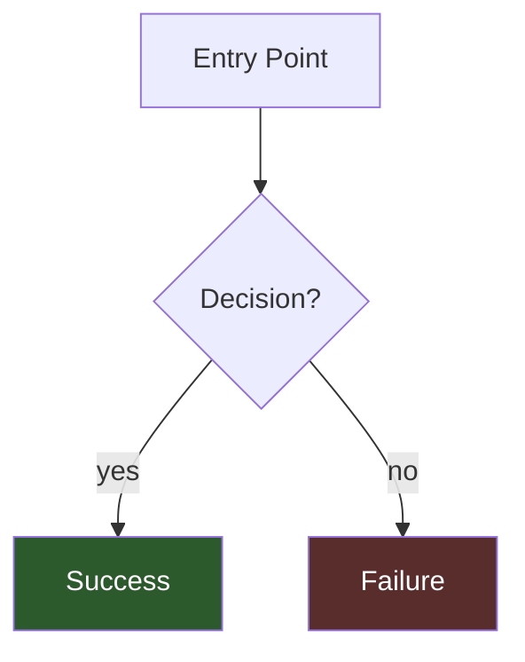

# Feature Documentation Rules

> **These rules define how to write and maintain feature documentation files in `.claude/features/`.**

---

## Accuracy (HARD REQUIREMENT)

All code references must match actual code exactly:
- `PlayerInvitationService.invitePlayer()` not `PlayerInvitationService.invite()`
- `PlayerInvitationModel.create()` not `PlayerInvitation.create()`
- If it's not in the code, it's not in the diagram
- **Verify every reference** by reading the actual file before documenting

---

## Required Sections

| Section | Purpose | Update Frequency |
|---------|---------|------------------|
| Status | Quick glance at completion | When layer completes |
| Flow Diagram | User journey + endpoints (Mermaid) | When flows change |
| Access Control | Decision logic flowchart (if applicable) | When rules change |
| Code Trace | Pseudocode logic flow | When logic changes |
| API Endpoints | Endpoint reference table | When endpoints change |
| Data Models | Schema quick reference | When models change |
| Frontend Notes | Starting point for FE work | When FE implements |
| Testing Checklist | What to verify | When tests added |

---

## Code Trace Style

Write pseudocode that explains logic, NOT file references:

```
GOOD:
├─ PlayService.startSession()
│  ├─ checkAccessMode()
│  │  ├─ if open → allow
│  │  └─ if isCreator → allow

BAD:
├─ play.service.ts:108 → PlayService.startSession()
│  ├─ play.service.ts:319 → checkAccessMode()
```

**Why:** Line numbers drift. Pseudocode stays accurate longer.

---

## Flow Diagram Conventions (Mermaid)

### Status Markers
- `[BE ✓]` - Backend implemented
- `[FE ○]` - Frontend planned
- `[FE ✓]` - Frontend implemented

### Structure

```mermaid
sequenceDiagram
    participant U as User
    participant FE as Frontend
    participant API as Backend API
    participant DB as Database

    rect rgb(40, 70, 40)
    Note right of U: SECTION NAME
    U->>FE: [FE ○] User action
    FE->>API: [BE ✓] POST /endpoint { body }
    Note right of API: ServiceName.methodName()
    API->>DB: [BE ✓] ModelName.operation()
    API-->>FE: [BE ✓] { response }
    end
```


### Guidelines
- Group related steps with `rect` blocks
- Add `Note right of API:` for key service methods
- Keep DB operations generic: `HuntModel.updateOne()` not the full query
- Use different rect colors for different contexts (editor vs player)

---

## Access Control Flowchart (when applicable)

For features with complex access logic, include a decision flowchart:



---

## API Endpoints Table Format

| Method | Endpoint | Auth | Purpose |
|--------|----------|------|---------|
| `POST` | `/resource` | Required (Admin) | Create resource |
| `GET` | `/resource/:id` | Required (View) | Get resource |

---

## Data Models Format

Show only the fields relevant to this feature:

```typescript
// ModelName
{
  fieldName: type,      // brief description
  otherField: type      // brief description
}
```

---

## What NOT to Include

- ❌ Line numbers (they drift)
- ❌ File paths in Code Trace (use service/method names only)
- ❌ Duplicate of full OpenAPI spec (just reference endpoints)
- ❌ Full code snippets (this is documentation, not code)
- ❌ Implementation details that belong in code comments

---

## Template

New feature docs should follow this structure:

```markdown
# Feature: [Feature Name]

[One-line description]

---

## Status

| Layer | Status |
|-------|--------|
| Backend | ○ Planned / ✓ Complete |
| Frontend (Editor) | ○ Planned / ✓ Complete |
| Frontend (Player) | ○ Planned / ✓ Complete |

---

## Flow Diagram

[Mermaid sequence diagram]

---

## Access Control

[Mermaid flowchart - if applicable]

---

## Code Trace

[Pseudocode for each major operation]

---

## API Endpoints

[Table of endpoints]

---

## Data Models

[Relevant model fields]

---

## Frontend Implementation Notes

[Component structure, hooks needed]

---

## Testing Checklist

### Backend
- [ ] Test case 1
- [ ] Test case 2

### Frontend
- [ ] Test case 1
- [ ] Test case 2
```

---

## Reference Implementation

See `play-link-sharing.md` for a complete example following these rules.
