# Feature: AI Hunt Generation

Generate complete treasure hunts from natural language prompts using OpenAI gpt-4o.

> **Documentation rules:** See [DOCUMENTATION-RULES.md](./DOCUMENTATION-RULES.md)

---

## Status

| Layer | Status |
|-------|--------|
| Backend | ◐ In Progress |
| Frontend (Editor) | ○ Planned |
| Frontend (Player) | N/A |

**Last Updated:** 2025-01-21 — Backend implementation in progress.

### Backend Implementation Status
- [x] Error classes (RateLimitError, ServiceUnavailableError, GenerationError)
- [x] OpenAPI types (GenerateHuntRequest, GenerateHuntResponse, etc.)
- [x] Prompt builder helper
- [ ] LLM hunt output validator (semantic validation only)
- [ ] Rate limiter (10/hour per user, in-memory)
- [ ] OpenAI generation provider (uses Structured Outputs)
- [ ] AI generation service (orchestration)
- [ ] API endpoint POST /api/hunts/generate

### Editor Implementation Status
- [ ] "Create with AI" button on dashboard
- [ ] AIGenerationDialog (prompt input)
- [ ] Loading state during generation
- [ ] Navigate to editor after success
- [ ] Error handling (rate limit, generation failure)

---

## Flow Diagram

```mermaid
sequenceDiagram
    participant U as User
    participant FE as Frontend
    participant API as Backend API
    participant AI as OpenAI
    participant DB as Database

    rect rgb(70, 70, 40)
    Note right of U: EDITOR: GENERATE HUNT
    U->>FE: [FE ○] Click "Create with AI"
    FE->>FE: [FE ○] Open AIGenerationDialog
    U->>FE: [FE ○] Enter prompt + optional style
    FE->>API: [BE ○] POST /api/hunts/generate { prompt, style? }
    Note right of API: AIGenerationService.generateHunt()
    API->>API: [BE ○] RateLimiter.checkRateLimit(userId)
    API->>AI: [BE ○] OpenAIProvider.generateHunt()
    Note right of AI: Structured Outputs with zodResponseFormat
    AI-->>API: [BE ○] Parsed & typed { name, description, steps[] }
    API->>API: [BE ○] LLMHuntOutputValidator.validateSemantics()
    API->>DB: [BE ○] HuntService.createHunt()
    API->>DB: [BE ○] HuntSaveService.saveHunt()
    API-->>FE: [BE ○] 201 { hunt, generationMetadata }
    FE->>FE: [FE ○] Navigate to /edit/{huntId}
    end
```



---

## Code Trace

### Generate Hunt (main flow)

```
POST /api/hunts/generate { prompt, style? }
│
├─ AIGenerationController.generateHunt()
│  └─ Extract prompt, style from request body
│
└─ AIGenerationService.generateHunt()
   │
   ├─ RateLimiter.checkRateLimit(userId)
   │  ├─ if count >= 10 per hour → 429 RateLimitError
   │  └─ else → increment counter
   │
   ├─ OpenAIProvider.generateHunt()
   │  ├─ PromptBuilder.buildSystemPrompt()
   │  │  └─ Challenge types, rules, examples
   │  ├─ PromptBuilder.buildUserPrompt(prompt, style)
   │  │
   │  └─ openai.beta.chat.completions.parse()
   │     └─ Uses zodResponseFormat(AIGeneratedHuntSchema, 'hunt')
   │     └─ OpenAI guarantees schema adherence at generation time
   │     └─ Returns pre-parsed, typed result via message.parsed
   │
   ├─ LLMHuntOutputValidator.validateSemantics(parsedHunt)
   │  └─ Business rules only (structure already guaranteed):
   │     ├─ quiz-choice: targetId matches an option id
   │     ├─ quiz-input: expectedAnswer is non-empty
   │     ├─ mission: type is upload-media (not match-location)
   │     ├─ steps: has variety (not all same type)
   │     └─ ON FAILURE → 500 GenerationError
   │
   ├─ HuntService.createHunt({ name, description }, userId)
   │  └─ Creates empty Hunt + HuntVersion
   │
   └─ HuntSaveService.saveHunt(huntId, huntWithSteps, userId)
      └─ Adds steps atomically (steps without stepId = new)

→ Response: { hunt, generationMetadata: { model, processingTimeMs, prompt } }
```

### Rate Limiting

```
RateLimiter.checkRateLimit(userId)
│
├─ Get userLimit from Map<userId, { count, resetTime }>
│
├─ if no entry OR now > resetTime
│  └─ Create { count: 1, resetTime: now + 1hr }
│
├─ if count >= MAX_PER_HOUR (10)
│  └─ throw RateLimitError
│
└─ else
   └─ increment count
```

---

## OpenAI Structured Outputs

This feature uses **OpenAI Structured Outputs** with native Zod support for guaranteed schema adherence.

### Why Structured Outputs?

1. **Guaranteed valid JSON** - OpenAI constrains generation to match schema
2. **No manual parsing** - No JSON.parse(), no markdown stripping
3. **No structural validation** - Schema adherence guaranteed at generation time
4. **Pre-parsed results** - `message.parsed` returns typed object
5. **Better error handling** - Refusals handled via `message.refusal`

### Implementation Pattern

```typescript
import OpenAI from 'openai';
import { zodResponseFormat } from 'openai/helpers/zod';
import { z } from 'zod';

const AIGeneratedHuntSchema = z.object({
  name: z.string(),
  description: z.string().optional(),
  steps: z.array(StepSchema),
});

const completion = await openai.beta.chat.completions.parse({
  model: 'gpt-4o-2024-08-06',
  messages: [
    { role: 'system', content: systemPrompt },
    { role: 'user', content: userPrompt },
  ],
  response_format: zodResponseFormat(AIGeneratedHuntSchema, 'hunt'),
});

const message = completion.choices[0].message;

if (message.refusal) {
  throw new GenerationError(message.refusal);
}

const hunt = message.parsed; // Already typed as AIGeneratedHunt!
```

### What Still Needs Validation

Semantic/business rules that OpenAI can't guarantee:

| Rule | Validation |
|------|------------|
| quiz-choice targetId | Must match one of the option ids |
| quiz-input expectedAnswer | Must be non-empty |
| mission type | Must be 'upload-media' (not 'match-location') |
| step variety | Should have mix of challenge types |

---

## API Endpoints

| Method | Endpoint | Auth | Purpose |
|--------|----------|------|---------|
| `POST` | `/api/hunts/generate` | Required | Generate hunt from prompt |

### Request Schema

```typescript
{
  prompt: string,        // 10-500 chars, required
  style?: 'educational' | 'adventure' | 'team-building' | 'family-friendly'
}
```

Note: Step count is NOT a parameter. AI determines appropriate number (3-10) based on prompt complexity.

### Response Schema

```typescript
{
  hunt: Hunt,            // Full Hunt DTO with steps
  generationMetadata: {
    model: string,       // "gpt-4o-2024-08-06"
    processingTimeMs: number,
    prompt: string       // Echo original prompt
  }
}
```

### Error Responses

| Status | Code | Condition |
|--------|------|-----------|
| 400 | VALIDATION_ERROR | Prompt too short (<10) or too long (>500) |
| 401 | UNAUTHORIZED | Not authenticated |
| 429 | RATE_LIMIT_EXCEEDED | >10 generations per hour |
| 500 | GENERATION_FAILED | AI refused or semantic validation failed |
| 503 | SERVICE_UNAVAILABLE | OpenAI service down |

---

## Data Models

### No New Database Models

This feature reuses existing models:
- `Hunt` - created via HuntService
- `HuntVersion` - created with Hunt
- `Step` - created via HuntSaveService

### In-Memory State (not persisted)

```typescript
// Rate limit tracking
Map<userId, { count: number, resetTime: number }>
```

### Constraints on Generated Data

Generated hunts will have these fields as null (user adds in editor):
- `hunt.startLocation`
- `step.requiredLocation`
- `step.media`
- `step.timeLimit`
- `step.maxAttempts`

---

## Frontend Implementation Notes

### Editor: Dashboard Integration

```
Dashboard
├── "Create Hunt" button (existing)
└── "Create with AI" button (new)
    └─ Opens AIGenerationDialog
```

### Editor: AIGenerationDialog

```
AIGenerationDialog
├── Prompt textarea (required, 10-500 chars)
├── Style dropdown (optional)
│   └─ educational | adventure | team-building | family-friendly
├── Generate button
│   └─ Disabled while generating
└── Loading state (5-10 seconds typical)
```

### Hooks Needed

```typescript
// useGenerateHunt - mutation hook
const { generateHunt, isGenerating, error } = useGenerateHunt();

// Usage in dialog
const handleGenerate = async () => {
  const { hunt } = await generateHunt({ prompt, style });
  navigate(`/edit/${hunt.huntId}`);
};
```

### Error Handling

| Error Code | User Message |
|------------|--------------|
| RATE_LIMIT_EXCEEDED | "You've reached the limit. Please wait before generating another hunt." |
| GENERATION_FAILED | "Failed to generate hunt. Try rephrasing your prompt." |
| SERVICE_UNAVAILABLE | "AI service is temporarily unavailable. Please try again later." |

---

## Testing Checklist

### Backend
- [ ] Valid prompt → hunt created with steps
- [ ] Style parameter influences content tone
- [ ] AI determines appropriate step count (3-10)
- [ ] Generated steps have variety (not all same type)
- [ ] Quiz-choice steps have options and valid targetId
- [ ] Quiz-input steps have expectedAnswer
- [ ] Mission steps have type upload-media only
- [ ] Task steps have instructions
- [ ] Rate limit blocks after 10 requests/hour
- [ ] Rate limit resets after 1 hour
- [ ] Semantic validation catches invalid targetId
- [ ] OpenAI refusal returns 500
- [ ] Prompt too short returns 400
- [ ] Unauthorized returns 401
- [ ] Hunt + steps created atomically

### Frontend
- [ ] "Create with AI" button visible on dashboard
- [ ] Dialog opens with empty form
- [ ] Form validation (min 10 chars)
- [ ] Loading state shown during generation
- [ ] Success navigates to editor
- [ ] Rate limit error shows helpful message
- [ ] Generation error shows retry suggestion
- [ ] Dialog closes on success or cancel

---

## Status Legend

```
[BE ○] - Backend planned
[BE ✓] - Backend implemented
[FE ○] - Frontend planned
[FE ✓] - Frontend implemented
```
