# Feature: AI Hunt Generation

Generate complete treasure hunts from natural language prompts using OpenAI gpt-4o.

> **Documentation rules:** See [DOCUMENTATION-RULES.md](DOCUMENTATION-RULES.md)

---

## Status

| Layer | Status |
|-------|--------|
| Backend | ✓ Complete |
| Frontend (Editor) | ○ Planned |
| Frontend (Player) | N/A |

**Last Updated:** 2025-01-21 — Backend implementation complete, 279/279 tests passing.

### Backend Implementation Status
- [x] Error classes (RateLimitError, ServiceUnavailableError, GenerationError)
- [x] OpenAPI types (GenerateHuntRequest, GenerateHuntResponse, GenerateHuntStyle, GenerationMetadata)
- [x] Prompt builder helper
- [x] AI hunt output schemas (Zod with `.nullish()` for OpenAI compatibility)
- [x] AI hunt output validator (semantic validation with safe/throwing variants)
- [x] Rate limiter middleware (`express-rate-limit`, 10/hour per user)
- [x] OpenAI hunt generator provider (Structured Outputs + retry with feedback)
- [x] AI generation service (orchestration)
- [x] AI generation controller
- [x] Routes mounted at `/api/hunts/generate`
- [x] DI container registration

### Editor Implementation Status
- [ ] Inline prompt textarea in DashboardHero
- [ ] Style selector (ToggleButtonGroup)
- [ ] GenerationProgress component
- [ ] Auto-trigger when arriving with pending prompt
- [ ] Navigate to `/editor/:id` after success
- [ ] Error handling (RATE_LIMIT_EXCEEDED, GENERATION_FAILED, etc.)

---

## Flow Diagram

```mermaid
sequenceDiagram
    participant U as User
    participant FE as Frontend
    participant API as Backend API
    participant AI as OpenAI
    participant DB as Database

    rect rgb(70, 70, 40)
    Note right of U: EDITOR: GENERATE HUNT
    U->>FE: [FE ○] Click "Create with AI"
    FE->>FE: [FE ○] Open AIGenerationDialog
    U->>FE: [FE ○] Enter prompt + optional style
    FE->>API: [BE ✓] POST /api/hunts/generate { prompt, style? }
    Note right of API: aiGenerationLimiter middleware
    API->>API: [BE ✓] Rate limit check (express-rate-limit)
    Note right of API: OpenAIHuntGenerator.generateHunt()
    API->>AI: [BE ✓] openai.chat.completions.parse()
    Note right of AI: Structured Outputs with zodResponseFormat
    AI-->>API: [BE ✓] Parsed { name, description, steps[] }
    API->>API: [BE ✓] safeValidateAIHunt() semantic validation
    alt Validation fails (max 1 retry)
        API->>AI: [BE ✓] Retry with error feedback
        AI-->>API: [BE ✓] Corrected response
    end
    Note right of API: AIHuntGenerationService.generateHunt()
    API->>DB: [BE ✓] HuntService.createHunt()
    API->>DB: [BE ✓] HuntSaveService.saveHunt()
    API-->>FE: [BE ✓] 201 { hunt, generationMetadata }
    FE->>FE: [FE ○] Navigate to /edit/{huntId}
    end
```



---

## Code Trace

### Generate Hunt (main flow)

```
POST /api/hunts/generate { prompt, style? }
│
├─ aiGenerationLimiter (express-rate-limit middleware)
│  ├─ if > 10 requests/hour → 429 { code: RATE_LIMIT_EXCEEDED }
│  └─ else → continue
│
├─ validateRequest(GenerateHuntRequest)
│  └─ Zod validation of request body
│
├─ AIHuntGenerationController.generateHunt()
│  └─ Extract prompt, style, userId from request
│
└─ AIHuntGenerationService.generateHunt()
   │
   ├─ OpenAIHuntGenerator.generateHunt()
   │  │
   │  ├─ buildSystemPrompt()
   │  │  └─ Challenge type docs, output format rules
   │  │
   │  ├─ buildUserPrompt(prompt, style)
   │  │  └─ User description + style-specific guidelines
   │  │
   │  ├─ callOpenAI(messages)
   │  │  └─ openai.chat.completions.parse()
   │  │     ├─ model: gpt-4o-2024-08-06
   │  │     ├─ response_format: zodResponseFormat(AIHuntSchema, 'hunt')
   │  │     └─ temperature: 0.7
   │  │
   │  ├─ safeValidateAIHunt(parsed)
   │  │  └─ Semantic validation via Zod superRefine:
   │  │     ├─ quiz-choice: targetId matches an option id
   │  │     ├─ quiz-input: expectedAnswer is non-empty
   │  │     ├─ mission: type is upload-media only
   │  │     ├─ task: instructions is non-empty
   │  │     └─ step: challenge has field matching type
   │  │
   │  └─ if validation fails && attempt < MAX_RETRIES (1)
   │     ├─ buildErrorFeedbackPrompt(errors)
   │     └─ retry with assistant response + error feedback
   │
   ├─ HuntService.createHunt({ name, description }, userId)
   │  └─ Creates empty Hunt + HuntVersion
   │
   ├─ buildHuntWithSteps(createdHunt, aiHunt)
   │  └─ Transform AI steps to Step DTOs (no stepId = new)
   │
   └─ HuntSaveService.saveHunt(huntId, huntWithSteps, userId)
      └─ Adds steps atomically

→ Response: { hunt, generationMetadata: { model, processingTimeMs, prompt } }
```

### Rate Limiting (express-rate-limit)

```
aiGenerationLimiter middleware
│
├─ keyGenerator: req.user?.id ?? req.ip ?? 'unknown'
├─ windowMs: 60 * 60 * 1000 (1 hour)
├─ limit: 10
│
├─ if exceeded
│  └─ 429 { code: RATE_LIMIT_EXCEEDED, message: "..." }
│
└─ else
   └─ Add rate limit headers (draft-7 standard)
```

---

## OpenAI Structured Outputs

This feature uses **OpenAI Structured Outputs** with native Zod support for guaranteed schema adherence.

### Why Structured Outputs?

1. **Guaranteed valid JSON** - OpenAI constrains generation to match schema
2. **No manual parsing** - No JSON.parse(), no markdown stripping
3. **No structural validation** - Schema adherence guaranteed at generation time
4. **Pre-parsed results** - `message.parsed` returns typed object
5. **Better error handling** - Refusals handled via `message.refusal`

### Nullish Fields for Optional Properties

OpenAI Structured Outputs requires `.nullish()` (or `.nullable()`) for optional fields. Using just `.optional()` causes failures.

```typescript
// CORRECT for OpenAI Structured Outputs
const AIQuizSchema = Quiz.extend({
  options: z.array(Option).nullish(),
  targetId: z.string().nullish(),
  expectedAnswer: z.string().nullish(),
});

// WRONG - will fail with Structured Outputs
const AIQuizSchema = Quiz.extend({
  options: z.array(Option).optional(),
});
```

### Implementation Pattern

```typescript
import { zodResponseFormat } from 'openai/helpers/zod';

const completion = await openai.chat.completions.parse({
  model: 'gpt-4o-2024-08-06',
  messages: [...],
  response_format: zodResponseFormat(AIHuntSchema, 'hunt'),
  temperature: 0.7,
});

const message = completion.choices[0].message;

if (message.refusal) {
  throw new GenerationError(message.refusal);
}

const hunt = message.parsed; // Already typed as AIGeneratedHunt
```

### Retry with Error Feedback

When semantic validation fails (e.g., targetId doesn't match options), the provider retries once with feedback:

```typescript
messages.push(
  { role: 'assistant', content: JSON.stringify(rawJson) },
  { role: 'user', content: buildErrorFeedbackPrompt(errors) },
);
```

---

## API Endpoints

| Method | Endpoint | Auth | Purpose |
|--------|----------|------|---------|
| `POST` | `/api/hunts/generate` | Required | Generate hunt from prompt |

### Request Schema

```typescript
{
  prompt: string,        // 10-500 chars, required
  style?: 'educational' | 'adventure' | 'team-building' | 'family-friendly' | null
}
```

Note: Step count is NOT a parameter. AI determines appropriate number (3-10) based on prompt complexity.

### Response Schema

```typescript
{
  hunt: Hunt,            // Full Hunt DTO with steps
  generationMetadata: {
    model: string,       // "gpt-4o-2024-08-06"
    processingTimeMs: number,
    prompt: string       // Echo original prompt
  }
}
```

### Error Responses

| Status | Code | Condition |
|--------|------|-----------|
| 400 | VALIDATION_ERROR | Prompt too short (<10) or too long (>500) |
| 401 | UNAUTHORIZED | Not authenticated |
| 429 | RATE_LIMIT_EXCEEDED | >10 generations per hour |
| 500 | GENERATION_FAILED | AI refused or semantic validation failed after retry |
| 503 | SERVICE_UNAVAILABLE | OpenAI service down or rate limited |

---

## Data Models

### No New Database Models

This feature reuses existing models:
- `Hunt` - created via HuntService
- `HuntVersion` - created with Hunt
- `Step` - created via HuntSaveService

### Rate Limiting State

Handled by `express-rate-limit` library (in-memory by default).

### Constraints on Generated Data

Generated hunts will have these fields as null (user adds in editor):
- `hunt.startLocation`
- `step.requiredLocation`
- `step.media`
- `step.timeLimit`
- `step.maxAttempts`

---

## File Structure

```
apps/backend/api/src/features/ai-generation/
├── ai-hunt-generation.routes.ts      # Express routes
├── ai-hunt-generation.controller.ts  # HTTP handler
├── ai-hunt-generation.service.ts     # Orchestration
├── ai-hunt-generator.provider.ts     # OpenAI integration
└── helpers/
    ├── prompt-builder.ts             # System/user prompt construction
    ├── ai-hunt-output.schema.ts      # Zod schemas for AI output
    └── ai-hunt-output.validator.ts   # Validation functions
```

---

## Frontend Implementation Notes

> **Design Spec:** See `.claude/implementation-plans/landing-page/hunthub-design-spec.md`
> **Implementation Plan:** See `.claude/implementation-plans/ai-hunt-generation-editor.md`

### Editor: Dashboard Integration (Inline Hero)

Per design spec, the AI prompt textarea is the **centerpiece** of the dashboard hero (NOT a dialog).

```
Dashboard
├── DashboardNavBar (with "Create Hunt" button for manual flow)
├── DashboardHero (gradient hero with prompt textarea)
│   ├── Prompt textarea (10-500 chars)
│   ├── Style selector (ToggleButtonGroup, optional)
│   └── Generate button (magic wand icon)
└── ContentContainer
    ├── GenerationProgress (when generating)
    ├── Hunt list (when has hunts)
    └── EmptyState (when no hunts)
```

### Auto-Trigger Flow (Landing Page → Dashboard)

1. User enters prompt on landing page
2. Landing page redirects to `build.hedgehunt.app?prompt=...`
3. `AppWithAuth.tsx` IIFE extracts prompt, stores in `sessionStorage.pendingPrompt`
4. If not logged in → LoginPage shows PromptPreview
5. After login → Dashboard reads sessionStorage, pre-fills textarea
6. **Auto-trigger** → Generation starts automatically if prompt exists
7. GenerationProgress → Shows loading state below hero
8. On success → Navigate to `/editor/{huntId}`

### Hooks Needed

```typescript
// apps/frontend/editor/src/api/Hunt/generateHunt.ts
export const useGenerateHunt = () => {
  const queryClient = useQueryClient();

  const mutation = useMutation({
    mutationFn: generateHunt,
    onSuccess: (data) => {
      void queryClient.invalidateQueries({ queryKey: huntKeys.lists() });
      queryClient.setQueryData(huntKeys.detail(data.hunt.huntId), data.hunt);
    },
  });

  return {
    generateHunt: mutation.mutate,
    generateHuntAsync: mutation.mutateAsync,
    isGenerating: mutation.isPending,
    generationError: mutation.error,
    reset: mutation.reset,
  };
};
```

### Error Handling (Use Backend Error Codes)

```typescript
catch (err) {
  const axiosError = err as { response?: { data?: { code?: string; message?: string } } };
  const code = axiosError.response?.data?.code;
  const message = axiosError.response?.data?.message;

  switch (code) {
    case 'RATE_LIMIT_EXCEEDED':
      snackbar.error('Generation limit reached. You can generate up to 10 hunts per hour.');
      break;
    case 'VALIDATION_ERROR':
      snackbar.error(message || 'Invalid prompt. Please try again.');
      break;
    case 'SERVICE_UNAVAILABLE':
      snackbar.error('AI service is temporarily unavailable. Please try again later.');
      break;
    case 'GENERATION_FAILED':
      snackbar.error('Generation failed. Please try rephrasing your prompt.');
      break;
    default:
      snackbar.error(message || 'Failed to generate hunt. Please try again.');
  }
}
```

### Critical Implementation Notes

- **ToggleButtonGroup**: Use existing `@/components/common/ToggleButton` (NOT raw MUI)
- **null → undefined**: MUI returns `null` on deselect, convert to `undefined` for frontend state
- **Prompt validation**: 10-500 chars, enforce with `maxLength` and disable button when invalid
- **Route**: Use `/editor/:id` (NOT `/edit/{huntId}`)

---

## Testing Checklist

### Backend ✓
- [x] Valid prompt → hunt created with steps
- [x] Style parameter accepted (educational, adventure, team-building, family-friendly)
- [x] AI determines appropriate step count (3-10)
- [x] Generated steps have challenge matching type
- [x] Quiz-choice steps have options and valid targetId (via Zod superRefine)
- [x] Quiz-input steps have expectedAnswer (via Zod superRefine)
- [x] Mission steps have type upload-media only (via Zod superRefine)
- [x] Task steps have instructions (via Zod superRefine)
- [x] Rate limit returns 429 after 10 requests/hour
- [x] Semantic validation retries once with feedback
- [x] OpenAI refusal returns GenerationError
- [x] Prompt too short returns 400
- [x] Unauthorized returns 401
- [x] Hunt + steps created atomically
- [x] Type-check passes
- [x] All 279 tests pass

### Frontend
- [ ] Prompt textarea visible in DashboardHero
- [ ] Style selector (ToggleButtonGroup) works, optional
- [ ] Generate button disabled when prompt < 10 or > 500 chars
- [ ] Character counter shows X/500
- [ ] Auto-trigger works when arriving from landing page
- [ ] GenerationProgress shows during generation
- [ ] Success navigates to `/editor/{huntId}`
- [ ] Error codes show correct messages (RATE_LIMIT_EXCEEDED, etc.)
- [ ] "Create manually" link opens HuntDialog

---

## Status Legend

```
[BE ○] - Backend planned
[BE ✓] - Backend implemented
[FE ○] - Frontend planned
[FE ✓] - Frontend implemented
```
