# Feature: AI Hunt Generation

Generate complete treasure hunts from natural language prompts using OpenAI gpt-4o.

> **Documentation rules:** See [DOCUMENTATION-RULES.md](./DOCUMENTATION-RULES.md)

---

## Status

| Layer | Status |
|-------|--------|
| Backend | ○ Planned |
| Frontend (Editor) | ○ Planned |
| Frontend (Player) | N/A |

**Last Updated:** 2025-01-20 — Feature planned, not yet implemented.

### Backend Implementation Status
- [ ] OpenAI generation provider
- [ ] AI generation service (orchestration)
- [ ] Output parser (validate LLM JSON)
- [ ] Rate limiter (10/hour per user)
- [ ] API endpoint POST /api/ai/generate-hunt

### Editor Implementation Status
- [ ] "Create with AI" button on dashboard
- [ ] AIGenerationDialog (prompt input)
- [ ] Loading state during generation
- [ ] Navigate to editor after success
- [ ] Error handling (rate limit, generation failure)

---

## Flow Diagram

```mermaid
sequenceDiagram
    participant U as User
    participant FE as Frontend
    participant API as Backend API
    participant AI as OpenAI
    participant DB as Database

    rect rgb(70, 70, 40)
    Note right of U: EDITOR: GENERATE HUNT
    U->>FE: [FE ○] Click "Create with AI"
    FE->>FE: [FE ○] Open AIGenerationDialog
    U->>FE: [FE ○] Enter prompt + options
    FE->>API: [BE ○] POST /api/ai/generate-hunt { prompt, style?, stepCount? }
    Note right of API: AIGenerationService.generateHunt()
    API->>API: [BE ○] RateLimiter.checkRateLimit(userId)
    API->>AI: [BE ○] OpenAIGenerationProvider.generateHunt()
    AI-->>API: [BE ○] { name, description, steps[] }
    API->>API: [BE ○] OutputParser.parseAndValidate()
    Note right of API: Retry once if validation fails
    API->>DB: [BE ○] HuntService.createHunt()
    API->>DB: [BE ○] HuntSaveService.saveHunt()
    API-->>FE: [BE ○] 201 { hunt, generationMetadata }
    FE->>FE: [FE ○] Navigate to /edit/{huntId}
    end
```



---

## Code Trace

### Generate Hunt (main flow)

```
POST /api/ai/generate-hunt { prompt, style?, stepCount? }
│
├─ AIGenerationController.generateHunt()
│  └─ Extract prompt, style, stepCount from request body
│
└─ AIGenerationService.generateHunt()
   │
   ├─ RateLimiter.checkRateLimit(userId)
   │  ├─ if count >= 10 per hour → 429 RateLimitError
   │  └─ else → increment counter
   │
   ├─ OpenAIGenerationProvider.generateHunt()
   │  ├─ PromptBuilder.buildSystemPrompt()
   │  │  └─ Challenge types, rules, JSON format
   │  ├─ PromptBuilder.buildUserPrompt(prompt, style, stepCount)
   │  └─ OpenAI.chat.completions.create()
   │     └─ gpt-4o with response_format: json_object
   │
   ├─ OutputParser.parseAndValidate(llmResponse)
   │  ├─ Strip markdown code blocks
   │  ├─ JSON.parse()
   │  ├─ Validate against AIGeneratedHuntSchema
   │  │  └─ Reuses StepCreate schema from @hunthub/shared
   │  ├─ Semantic validation (quiz-choice has options, etc.)
   │  │
   │  └─ ON VALIDATION FAILURE:
   │     ├─ Retry once with error context in prompt
   │     └─ If still fails → 500 GenerationError
   │
   ├─ HuntService.createHunt({ name, description }, userId)
   │  └─ Creates empty Hunt + HuntVersion
   │
   └─ HuntSaveService.saveHunt(huntId, huntWithSteps, userId)
      └─ Adds steps atomically (steps without stepId = new)

→ Response: { hunt, generationMetadata: { model, processingTimeMs, prompt } }
```

### Rate Limiting

```
RateLimiter.checkRateLimit(userId)
│
├─ Get userLimit from Map<userId, { count, resetTime }>
│
├─ if no entry OR now > resetTime
│  └─ Create { count: 1, resetTime: now + 1hr }
│
├─ if count >= MAX_PER_HOUR (10)
│  └─ throw RateLimitError
│
└─ else
   └─ increment count
```

---

## API Endpoints

| Method | Endpoint | Auth | Purpose |
|--------|----------|------|---------|
| `POST` | `/api/ai/generate-hunt` | Required | Generate hunt from prompt |

### Request Schema

```typescript
{
  prompt: string,        // 10-500 chars, required
  style?: 'educational' | 'adventure' | 'team-building' | 'family-friendly',
  stepCount?: number     // 3-10, default 5
}
```

### Response Schema

```typescript
{
  hunt: Hunt,            // Full Hunt DTO with steps
  generationMetadata: {
    model: string,       // "gpt-4o"
    processingTimeMs: number,
    prompt: string       // Echo original prompt
  }
}
```

### Error Responses

| Status | Code | Condition |
|--------|------|-----------|
| 400 | VALIDATION_ERROR | Prompt too short (<10) or too long (>500) |
| 401 | UNAUTHORIZED | Not authenticated |
| 429 | RATE_LIMIT_EXCEEDED | >10 generations per hour |
| 500 | GENERATION_FAILED | AI failed after retries |
| 503 | SERVICE_UNAVAILABLE | OpenAI service down |

---

## Data Models

### No New Database Models

This feature reuses existing models:
- `Hunt` - created via HuntService
- `HuntVersion` - created with Hunt
- `Step` - created via HuntSaveService

### In-Memory State (not persisted)

```typescript
// Rate limit tracking
Map<userId, { count: number, resetTime: number }>
```

### Constraints on Generated Data

Generated hunts will have these fields as null (user adds in editor):
- `hunt.startLocation`
- `step.requiredLocation`
- `step.media`
- `step.timeLimit`
- `step.maxAttempts`

---

## Frontend Implementation Notes

### Editor: Dashboard Integration

```
Dashboard
├── "Create Hunt" button (existing)
└── "Create with AI" button (new)
    └─ Opens AIGenerationDialog
```

### Editor: AIGenerationDialog

```
AIGenerationDialog
├── Prompt textarea (required, 10-500 chars)
├── Style dropdown (optional)
│   └─ educational | adventure | team-building | family-friendly
├── Step count slider (3-10, default 5)
├── Generate button
│   └─ Disabled while generating
└── Loading state (5-10 seconds typical)
```

### Hooks Needed

```typescript
// useGenerateHunt - mutation hook
const { generateHunt, isGenerating, error } = useGenerateHunt();

// Usage in dialog
const handleGenerate = async () => {
  const { hunt } = await generateHunt({ prompt, style, stepCount });
  navigate(`/edit/${hunt.huntId}`);
};
```

### Error Handling

| Error Code | User Message |
|------------|--------------|
| RATE_LIMIT_EXCEEDED | "You've reached the limit. Please wait before generating another hunt." |
| GENERATION_FAILED | "Failed to generate hunt. Try rephrasing your prompt." |
| SERVICE_UNAVAILABLE | "AI service is temporarily unavailable. Please try again later." |

---

## Testing Checklist

### Backend
- [ ] Valid prompt → hunt created with requested step count
- [ ] Style parameter influences challenge type distribution
- [ ] Generated steps have variety (not all same type)
- [ ] Quiz-choice steps have options and targetId
- [ ] Quiz-input steps have expectedAnswer
- [ ] Mission steps have type (upload-media only, no match-location)
- [ ] Task steps have instructions
- [ ] Rate limit blocks after 10 requests/hour
- [ ] Rate limit resets after 1 hour
- [ ] Malformed LLM output triggers retry
- [ ] Retry with error context succeeds
- [ ] Exhausted retries return 500
- [ ] Prompt too short returns 400
- [ ] Unauthorized returns 401
- [ ] Hunt + steps created atomically

### Frontend
- [ ] "Create with AI" button visible on dashboard
- [ ] Dialog opens with empty form
- [ ] Form validation (min 10 chars)
- [ ] Loading state shown during generation
- [ ] Success navigates to editor
- [ ] Rate limit error shows helpful message
- [ ] Generation error shows retry suggestion
- [ ] Dialog closes on success or cancel

---

## Status Legend

```
[BE ○] - Backend planned
[BE ✓] - Backend implemented
[FE ○] - Frontend planned
[FE ✓] - Frontend implemented
```
