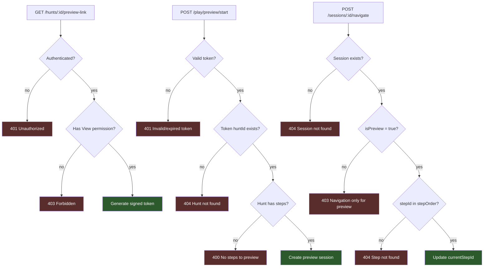

# Feature: Author Preview

Enable content authors to preview their hunt in the production player environment via signed URL with free step navigation.

> **Documentation rules:** See [DOCUMENTATION-RULES.md](./DOCUMENTATION-RULES.md)

---

## Status

| Layer | Status |
|-------|--------|
| Backend | ✓ Implemented |
| Frontend (Editor) | ○ Planned |
| Frontend (Player) | ○ Planned |

**Last Updated:** 2025-01-20 — Backend implementation complete.

### Backend Implementation Status
- [x] Add `isPreview` field to Progress model
- [x] Create preview token utility (HMAC-SHA256)
- [x] Create PreviewService with generatePreviewLink + startPreviewSession
- [x] Add navigate endpoint for free step navigation
- [x] Modify getStep to allow any step access for preview
- [x] Routes added (GET /hunts/:id/preview-link, POST /play/preview/start, POST /sessions/:id/navigate)

### Editor Implementation Status
- [ ] useGetPreviewLink hook
- [ ] "Preview as Player" button in SharePanel/LinkSection

### Player Implementation Status
- [ ] `/play/preview` route
- [ ] AuthorPreviewPage component
- [ ] AuthorPreviewSessionProvider (auto-start, no localStorage)
- [ ] PreviewNavigation component (prev/next buttons)
- [ ] useStartPreviewSession hook
- [ ] useNavigateToStep hook

---

## Flow Diagram

```mermaid
sequenceDiagram
    participant U as User
    participant FE as Frontend
    participant API as Backend API
    participant DB as Database

    rect rgb(70, 70, 40)
    Note right of U: EDITOR: GENERATE PREVIEW LINK
    U->>FE: [FE ○] Click "Preview as Player"
    FE->>API: [BE ✓] GET /hunts/:id/preview-link
    Note right of API: PreviewService.generatePreviewLink()
    API->>API: [BE ✓] Validate View permission
    API->>API: [BE ✓] Create signed token (huntId, userId, exp)
    API-->>FE: [BE ✓] { previewUrl, expiresIn }
    FE->>FE: [FE ○] window.open(previewUrl, '_blank')
    end

    rect rgb(40, 70, 70)
    Note right of U: PLAYER: START PREVIEW SESSION
    U->>FE: [FE ○] Open /play/preview?token=TOKEN
    FE->>FE: [FE ○] Extract token from URL
    FE->>API: [BE ✓] POST /play/preview/start { previewToken }
    Note right of API: PreviewService.startPreviewSession()
    API->>API: [BE ✓] Verify token signature + expiry
    API->>DB: [BE ✓] SessionManager.createPreviewSession()
    API-->>FE: [BE ✓] { sessionId, hunt, stepOrder, isPreview: true }
    FE->>FE: [FE ○] NO localStorage (fresh each time)
    FE->>FE: [FE ○] Render step + PreviewNavigation
    end

    rect rgb(40, 70, 70)
    Note right of U: PLAYER: NAVIGATE STEPS
    U->>FE: [FE ○] Click prev/next arrow
    FE->>API: [BE ✓] POST /play/sessions/:id/navigate { stepId }
    Note right of API: PlayService.navigate()
    API->>API: [BE ✓] Verify isPreview session
    API->>DB: [BE ✓] SessionManager.navigateToStep()
    API-->>FE: [BE ✓] { currentStepId, currentStepIndex }
    FE->>FE: [FE ○] Update React Query cache
    FE->>FE: [FE ○] Render new step
    end

    rect rgb(40, 70, 70)
    Note right of U: PLAYER: VALIDATE STEP (normal flow)
    U->>FE: [FE ○] Submit answer
    FE->>API: [BE ✓] POST /play/sessions/:id/validate
    Note right of API: PlayService.validateAnswer() - same as production
    API->>DB: [BE ✓] Record submission, advance if correct
    API-->>FE: [BE ✓] { correct, feedback, attempts }
    FE->>FE: [FE ○] Show feedback, "Continue" advances normally
    end
```



---

## Access Control



**Key differences from player access:**
1. Preview requires authenticated user with View permission (not public)
2. Preview uses token validation (not playSlug lookup)
3. Preview uses latestVersion (draft), not liveVersion
4. Preview allows navigation to any step (not sequential)

---

## Code Trace

### Generate Preview Link

```
GET /hunts/:id/preview-link
│
├─ PreviewController.getPreviewLink()
│  └─ Extract huntId from params, userId from req.user
│
└─ PreviewService.generatePreviewLink()
   │
   ├─ authorizationService.requireAccess(huntId, userId, View)
   │  └─ Verify user has at least View permission
   │
   ├─ createPreviewToken(huntId, userId)
   │  ├─ Build payload { huntId, userId, exp: now + 15min, nonce }
   │  ├─ Sign with HMAC-SHA256 using PREVIEW_TOKEN_SECRET
   │  └─ Return base64url encoded token
   │
   └─ Build previewUrl = PLAYER_URL/play/preview?token={token}

→ Response: { previewUrl, expiresIn: 900 }
```

### Start Preview Session

```
POST /play/preview/start { previewToken }
│
├─ PreviewController.startPreviewSession()
│
└─ PreviewService.startPreviewSession()
   │
   ├─ verifyPreviewToken(previewToken)
   │  ├─ Decode base64url
   │  ├─ Verify HMAC-SHA256 signature
   │  ├─ Check exp > now
   │  └─ Return { huntId, userId } or null
   │
   ├─ HuntModel.findOne({ huntId })
   │  └─ Throw 404 if not found
   │
   ├─ HuntVersionModel.findOne({ huntId, version: latestVersion })
   │  └─ Use latestVersion (draft), NOT liveVersion
   │
   └─ SessionManager.createPreviewSession()
      ├─ Generate sessionId (UUID)
      ├─ Create Progress with isPreview: true
      └─ Set currentStepId = stepOrder[0]

→ Response: { sessionId, hunt, status, currentStepId, stepOrder, isPreview: true }
```

### Navigate to Step (Preview Only)

**Note:** Navigate lives in PlayService (not PreviewService) because it operates on existing sessions. This allows future extension for regular sessions (e.g., "skip step" feature) without architectural changes.

```
POST /play/sessions/:sessionId/navigate { stepId }
│
├─ PlayController.navigate()
│
└─ PlayService.navigate()
   │
   ├─ SessionManager.requireSession(sessionId)
   │
   ├─ if (!progress.isPreview)
   │  └─ Throw 403 "Navigation only available in preview mode"
   │
   ├─ requireHuntVersion(huntId, version)
   │
   ├─ if (!stepOrder.includes(stepId))
   │  └─ Throw 404 "Step not found in hunt"
   │
   └─ SessionManager.navigateToStep(sessionId, stepId)
      └─ ProgressModel.updateOne({ currentStepId: stepId })

→ Response: { currentStepId, currentStepIndex }
```

### Get Step (Modified for Preview)

```
GET /play/sessions/:sessionId/step/:stepId
│
├─ PlayController.getStep()
│
└─ PlayService.getStep()
   │
   ├─ SessionManager.requireSession(sessionId)
   │
   ├─ if (progress.isPreview)
   │  │  # Preview: allow any step
   │  └─ if (!stepOrder.includes(stepId))
   │        └─ Throw 404 "Step not found"
   │
   ├─ else
   │  │  # Normal: sequential access only
   │  └─ if (!allowedStepIds.includes(stepId))
   │        └─ Throw 403 "Step not accessible"
   │
   └─ ... existing step fetch logic ...

→ Response: { step, stepIndex, totalSteps, _links }
```

---

## API Endpoints

| Method | Endpoint | Auth | Purpose |
|--------|----------|------|---------|
| `GET` | `/hunts/:id/preview-link` | Required (View) | Generate signed preview URL |
| `POST` | `/play/preview/start` | Token | Start preview session |
| `POST` | `/play/sessions/:id/navigate` | Session (Preview only) | Jump to any step |

**Note:** Existing endpoints used without modification:
- `GET /play/sessions/:id` - Get session (works for preview)
- `GET /play/sessions/:id/step/:stepId` - Get step (modified access logic)
- `POST /play/sessions/:id/validate` - Validate answer (same behavior)
- `POST /play/sessions/:id/hint` - Request hint (same behavior)

---

## Data Models

### Progress (updated fields)

```typescript
{
  isPreview?: boolean,  // true for preview sessions (default: false)
  // ... existing fields unchanged
}
```

**TTL:** Preview sessions use the same TTL as regular sessions (MongoDB only allows one TTL index per collection). Token expires in 15 minutes, but once a session starts, authors can preview until the standard session TTL.

### Preview Token Payload (transient, not stored)

```typescript
{
  huntId: number,
  userId: string,
  exp: number,     // Unix timestamp (15 minutes from creation)
  nonce: string    // Random string for uniqueness
}
```

**Token flow:** The token is embedded in the URL for shareability. When the player app loads, it extracts the token from URL query params and sends it via POST body to start the session.

---

## Frontend Implementation Notes

### Editor: SharePanel/LinkSection

```
SharePanel
├── [NEW] "Preview as Player" button (always visible)
│   └── onClick: getPreviewLink(huntId) → window.open(previewUrl)
├── [EXISTING] Link display (hunt.playSlug)
├── [EXISTING] Copy button
├── [EXISTING] Access mode toggle
└── [EXISTING] Reset link button
```

### Player: AuthorPreviewPage

```
Route: /play/preview?token=TOKEN

AuthorPreviewPage
├── Extract token from useSearchParams()
├── If no token → ErrorState "Invalid preview link"
└── AuthorPreviewSessionProvider (token)
    └── ApiValidationProvider (onAdvance)
        ├── PreviewNavigation (prev/next buttons)
        └── StepRenderer (same as production)
```

### Player: AuthorPreviewSessionProvider

**Separate from PlaySessionProvider because:**
1. Auto-starts with token (no player identification)
2. Has navigateToStep/Next/Prev actions
3. No localStorage persistence

```typescript
AuthorPreviewSessionProvider
├── useStartPreviewSession(token) - auto-fetch session
├── useNavigateToStep() - mutation for navigation
├── Provides SessionStateContext with { isPreview: true, stepOrder }
└── Provides SessionActionsContext with { navigateToStep, navigateNext, navigatePrev }
```

### Player: PreviewNavigation

```
PreviewNavigation
├── Prev button (disabled if currentStepIndex === 0)
├── "Step X of Y" indicator
└── Next button (disabled if currentStepIndex === totalSteps - 1)
```

---

## Testing Checklist

### Backend (Integration tests pending)
- [ ] Generate preview link with View permission → success
- [ ] Generate preview link without auth → 401
- [ ] Generate preview link without access → 403
- [ ] Start preview session with valid token → success
- [ ] Start preview session with expired token → 401
- [ ] Start preview session with invalid signature → 401
- [ ] Navigate in preview session → success
- [ ] Navigate in non-preview session → 403
- [ ] Navigate to invalid stepId → 404
- [ ] Get any step in preview session → success
- [ ] Preview session uses latestVersion (not liveVersion)

### Frontend Editor
- [ ] "Preview as Player" button visible in SharePanel
- [ ] Button works even before hunt is released
- [ ] Clicking button opens preview URL in new tab
- [ ] Loading state while generating link

### Frontend Player
- [ ] `/play/preview?token=X` auto-starts session (no identification form)
- [ ] Missing token shows error state
- [ ] Invalid/expired token shows error state
- [ ] Prev/Next navigation works
- [ ] Prev disabled on first step, Next disabled on last step
- [ ] Validation works normally (advances on correct)
- [ ] Can navigate back after validation
- [ ] Session not saved to localStorage
- [ ] Closing and reopening preview link creates fresh session

---

## Status Legend

```
[BE ○] - Backend planned
[BE ✓] - Backend implemented
[FE ○] - Frontend planned
[FE ✓] - Frontend implemented
```
