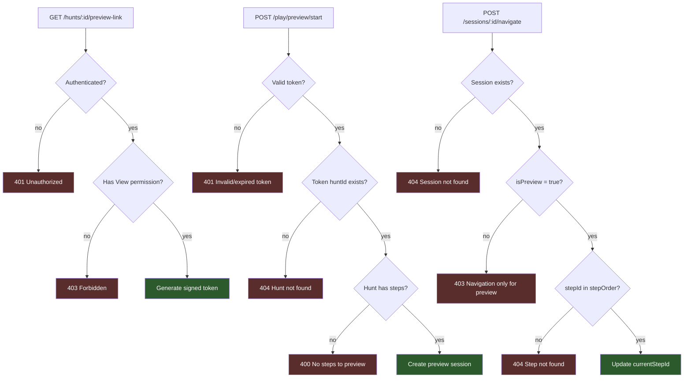

# Feature: Author Preview

Enable content authors to preview their hunt in the production player environment via signed URL with free step navigation.

> **Documentation rules:** See [DOCUMENTATION-RULES.md](./DOCUMENTATION-RULES.md)

---

## Status

| Layer | Status |
|-------|--------|
| Backend | ✓ Implemented |
| Frontend (Editor) | ✓ Implemented |
| Frontend (Player) | ✓ Implemented |

**Last Updated:** 2025-01-20 — Full implementation complete.

### Backend Implementation Status
- [x] Add `isPreview` field to Progress model
- [x] Create preview token utility (HMAC-SHA256)
- [x] Create PreviewService with generatePreviewLink + startPreviewSession
- [x] Add navigate endpoint for free step navigation
- [x] Modify getStep to allow any step access for preview
- [x] Routes added (GET /hunts/:id/preview-link, POST /play/preview/start, POST /sessions/:id/navigate)

### Editor Implementation Status
- [x] useGetPreviewLink hook (`apps/frontend/editor/src/api/Hunt/sharing/getPreviewLink.ts`)
- [x] "Preview Hunt" dropdown in HuntPreview component (content preview area)

### Player Implementation Status
- [x] `/play/preview` route (lazy-loaded)
- [x] AuthorPreviewPage component
- [x] AuthorPreviewSessionProvider (auto-start, no localStorage)
- [x] PreviewNavigation component (prev/next buttons, step indicator)
- [x] useStartPreviewSession hook
- [x] useNavigateToStep hook
- [x] Extended SessionContexts with `isPreview`, `stepOrder`, navigation actions
- [x] Shared types in `@hunthub/shared` (PreviewSessionResponse, NavigateRequest, NavigateResponse)

---

## Flow Diagram

```mermaid
sequenceDiagram
    participant U as User
    participant FE as Frontend
    participant API as Backend API
    participant DB as Database

    rect rgb(70, 70, 40)
    Note right of U: EDITOR: GENERATE PREVIEW LINK
    U->>FE: [FE ✓] Click "Preview Hunt" dropdown
    FE->>API: [BE ✓] GET /hunts/:id/preview-link
    Note right of API: PreviewService.generatePreviewLink()
    API->>API: [BE ✓] Validate View permission
    API->>API: [BE ✓] Create signed token (huntId, userId, exp)
    API-->>FE: [BE ✓] { previewUrl, expiresIn }
    FE->>FE: [FE ✓] Open in Browser OR Copy Link
    end

    rect rgb(40, 70, 70)
    Note right of U: PLAYER: START PREVIEW SESSION
    U->>FE: [FE ✓] Open /play/preview?token=TOKEN
    FE->>FE: [FE ✓] Extract token from URL
    FE->>API: [BE ✓] POST /play/preview/start { previewToken }
    Note right of API: PreviewService.startPreviewSession()
    API->>API: [BE ✓] Verify token signature + expiry
    API->>DB: [BE ✓] SessionManager.createPreviewSession()
    API-->>FE: [BE ✓] { sessionId, hunt, stepOrder, isPreview: true }
    FE->>FE: [FE ✓] NO localStorage (fresh each time)
    FE->>FE: [FE ✓] Render step + PreviewNavigation
    end

    rect rgb(40, 70, 70)
    Note right of U: PLAYER: NAVIGATE STEPS
    U->>FE: [FE ✓] Click prev/next arrow
    FE->>API: [BE ✓] POST /play/sessions/:id/navigate { stepId }
    Note right of API: PlayService.navigate()
    API->>API: [BE ✓] Verify isPreview session
    API->>DB: [BE ✓] SessionManager.navigateToStep()
    API-->>FE: [BE ✓] { currentStepId, currentStepIndex }
    FE->>FE: [FE ✓] Update React Query cache
    FE->>FE: [FE ✓] Render new step
    end

    rect rgb(40, 70, 70)
    Note right of U: PLAYER: VALIDATE STEP (normal flow)
    U->>FE: [FE ✓] Submit answer
    FE->>API: [BE ✓] POST /play/sessions/:id/validate
    Note right of API: PlayService.validateAnswer() - same as production
    API->>DB: [BE ✓] Record submission, advance if correct
    API-->>FE: [BE ✓] { correct, feedback, attempts }
    FE->>FE: [FE ✓] Show feedback, "Continue" advances normally
    end
```



---

## Access Control



**Key differences from player access:**
1. Preview requires authenticated user with View permission (not public)
2. Preview uses token validation (not playSlug lookup)
3. Preview uses latestVersion (draft), not liveVersion
4. Preview allows navigation to any step (not sequential)

---

## Code Trace

### Generate Preview Link

```
GET /hunts/:id/preview-link
│
├─ PreviewController.getPreviewLink()
│  └─ Extract huntId from params, userId from req.user
│
└─ PreviewService.generatePreviewLink()
   │
   ├─ authorizationService.requireAccess(huntId, userId, View)
   │  └─ Verify user has at least View permission
   │
   ├─ createPreviewToken(huntId, userId)
   │  ├─ Build payload { huntId, userId, exp: now + 15min, nonce }
   │  ├─ Sign with HMAC-SHA256 using PREVIEW_TOKEN_SECRET
   │  └─ Return base64url encoded token
   │
   └─ Build previewUrl = PLAYER_URL/play/preview?token={token}

→ Response: { previewUrl, expiresIn: 900 }
```

### Start Preview Session

```
POST /play/preview/start { previewToken }
│
├─ PreviewController.startPreviewSession()
│
└─ PreviewService.startPreviewSession()
   │
   ├─ verifyPreviewToken(previewToken)
   │  ├─ Decode base64url
   │  ├─ Verify HMAC-SHA256 signature
   │  ├─ Validate payload with Zod schema
   │  ├─ Check exp > now
   │  └─ Return { huntId, userId } or error
   │
   ├─ authorizationService.requireAccess(huntId, userId, View)
   │  └─ Re-verify access (in case revoked after token issued)
   │
   ├─ HuntModel.findOne({ huntId })
   │  └─ Throw 404 if not found
   │
   ├─ HuntVersionModel.findOne({ huntId, version: latestVersion })
   │  └─ Use latestVersion (draft), NOT liveVersion
   │
   └─ SessionManager.createPreviewSession()
      ├─ Generate sessionId (UUID)
      ├─ Create Progress with isPreview: true
      └─ Set currentStepId = stepOrder[0]

→ Response: { sessionId, hunt, status, currentStepId, stepOrder, isPreview: true }
```

### Navigate to Step (Preview Only)

**Note:** Navigate lives in PlayService (not PreviewService) because it operates on existing sessions. This allows future extension for regular sessions (e.g., "skip step" feature) without architectural changes.

```
POST /play/sessions/:sessionId/navigate { stepId }
│
├─ validateRequest(navigateSchema)
│  └─ Validates stepId is positive integer
│
├─ PlayController.navigate()
│
└─ PlayService.navigate()
   │
   ├─ SessionManager.requireSession(sessionId)
   │
   ├─ if (!progress.isPreview)
   │  └─ Throw 403 "Navigation only available in preview mode"
   │
   ├─ requireHuntVersion(huntId, version)
   │
   └─ SessionManager.navigateToStep(sessionId, stepId, stepOrder)
      └─ Atomic aggregation: set currentStepId + conditional push step progress

→ Response: { currentStepId, currentStepIndex }
```

### Get Step (Modified for Preview)

```
GET /play/sessions/:sessionId/step/:stepId
│
├─ PlayController.getStep()
│
└─ PlayService.getStep()
   │
   ├─ SessionManager.requireSession(sessionId)
   │
   ├─ if (progress.isPreview)
   │  │  # Preview: allow any step
   │  └─ if (!stepOrder.includes(stepId))
   │        └─ Throw 404 "Step not found"
   │
   ├─ else
   │  │  # Normal: sequential access only
   │  └─ if (!allowedStepIds.includes(stepId))
   │        └─ Throw 403 "Step not accessible"
   │
   └─ ... existing step fetch logic ...

→ Response: { step, stepIndex, totalSteps, _links }
```

---

## API Endpoints

| Method | Endpoint | Auth | Purpose |
|--------|----------|------|---------|
| `GET` | `/hunts/:id/preview-link` | Required (View) | Generate signed preview URL |
| `POST` | `/play/preview/start` | Token | Start preview session |
| `POST` | `/play/sessions/:id/navigate` | Session (Preview only) | Jump to any step |

**Note:** Existing endpoints used without modification:
- `GET /play/sessions/:id` - Get session (works for preview)
- `GET /play/sessions/:id/step/:stepId` - Get step (modified access logic)
- `POST /play/sessions/:id/validate` - Validate answer (same behavior)
- `POST /play/sessions/:id/hint` - Request hint (same behavior)

---

## Data Models

### Progress (updated fields)

```typescript
{
  isPreview?: boolean,  // true for preview sessions (default: false)
  // ... existing fields unchanged
}
```

**TTL:** Preview sessions have a separate 2-hour TTL index in production (anonymous sessions have 24-hour TTL). Token expires in 15 minutes, session expires in 2 hours. This is sufficient for preview testing.

### Preview Token Payload (transient, not stored)

```typescript
{
  huntId: number,
  userId: string,
  exp: number,     // Unix timestamp (15 minutes from creation)
  nonce: string    // Random string for uniqueness
}
```

**Token flow:** The token is embedded in the URL for shareability. When the player app loads, it extracts the token from URL query params and sends it via POST body to start the session.

---

## Frontend Implementation Notes

### Editor: HuntPreview (Content Preview Area) ✓

**Location:** `apps/frontend/editor/src/pages/Hunt/HuntPreview/HuntPreview.tsx`

**Why HuntPreview instead of SharePanel:**
- Preview is about **testing/validation**, not **sharing/distribution**
- Groups with other testing controls (Simulate Success/Fail)
- Available when preview panel is open (natural testing workflow)

```
HuntPreview
├── [EXISTING] Simulate: Success/Fail toggle
├── [NEW] "Preview Hunt" dropdown button
│   ├── "Open in Browser" → getPreviewLink(huntId) → window.open(previewUrl)
│   └── "Copy Link" → getPreviewLink(huntId) → copy to clipboard + toast with expiry
└── [EXISTING] Mobile preview iframe
```

**Hook:** `useGetPreviewLink()` in `apps/frontend/editor/src/api/Hunt/sharing/getPreviewLink.ts`

### Player: AuthorPreviewPage

```
Route: /play/preview?token=TOKEN

AuthorPreviewPage
├── Extract token from useSearchParams()
├── If no token → ErrorState "Invalid preview link"
└── AuthorPreviewSessionProvider (token)
    └── ApiValidationProvider (onAdvance)
        ├── PreviewNavigation (prev/next buttons)
        └── StepRenderer (same as production)
```

### Player: AuthorPreviewSessionProvider

**Separate from PlaySessionProvider because:**
1. Auto-starts with token (no player identification)
2. Has navigateToStep/Next/Prev actions
3. No localStorage persistence

```typescript
AuthorPreviewSessionProvider
├── useStartPreviewSession(token) - auto-fetch session
├── useNavigateToStep() - mutation for navigation
├── Provides SessionStateContext with { isPreview: true, stepOrder }
└── Provides SessionActionsContext with { navigateToStep, navigateNext, navigatePrev }
```

### Player: PreviewNavigation

```
PreviewNavigation
├── Prev button (disabled if currentStepIndex === 0)
├── "Step X of Y" indicator
└── Next button (disabled if currentStepIndex === totalSteps - 1)
```

---

## Architecture: PlaySessionProvider vs AuthorPreviewSessionProvider

Both providers share the same React contexts (`SessionStateContext`, `SessionActionsContext`) but implement fundamentally different progression models.

### Mental Model Comparison

| Aspect | PlaySessionProvider | AuthorPreviewSessionProvider |
|--------|---------------------|------------------------------|
| **Philosophy** | "Earn the right to see next step" | "See any step to test your hunt" |
| **Progression** | Linear, backend-controlled | Non-linear, frontend-controlled |
| **Next step source** | HATEOAS `_links.next` | `stepOrder[]` array |
| **Navigation** | None (must complete to advance) | Full freedom (prev/next/jump) |
| **Persistence** | localStorage (resumable) | None (ephemeral, token-based) |
| **Session start** | Manual (player identification) | Auto (token in URL) |

### Why Two Providers (Not One with Flags)

We chose separate providers over a configurable single provider because:
1. **Different data sources** - Play uses HATEOAS links, Preview uses stepOrder array
2. **Different refs needed** - Play needs `nextStepIdRef`, Preview needs `stepOrderRef` + `currentStepIndexRef`
3. **Different actions** - Preview has `navigateToStep/Next/Prev`, Play doesn't
4. **Cleaner code** - No conditional logic in callbacks, each provider is focused

### Refs Explained

| Ref | Play | Preview | Purpose |
|-----|:----:|:-------:|---------|
| `sessionIdRef` | ✓ | ✓ | Stable sessionId for cache updates in useMemo callbacks |
| `nextStepIdRef` | ✓ | — | Next step from HATEOAS (backend tells us) |
| `stepOrderRef` | — | ✓ | Full step array (frontend knows all steps) |
| `currentStepIndexRef` | — | ✓ | Position in array (to calculate prev/next) |

**Why refs instead of state?** These values are read-only derivations from query data. We need stable references in `useMemo` callbacks without causing re-renders or stale closures.

### How `advanceToNextStep` Differs

Both providers implement `advanceToNextStep` (called when player completes a challenge), but they calculate the next step differently:

**PlaySessionProvider:**
```typescript
advanceToNextStep: () => {
  const currentNextStepId = nextStepIdRef.current;  // From HATEOAS _links.next
  // ...
  currentStepId: currentNextStepId,  // Backend told us what's next
}
```

**AuthorPreviewSessionProvider:**
```typescript
advanceToNextStep: () => {
  const stepOrder = stepOrderRef.current;
  const currentIndex = currentStepIndexRef.current;
  const nextIndex = currentIndex + 1;
  // ...
  currentStepId: stepOrder[nextIndex],  // Frontend calculates from array
}
```

### Shared Code: useStepManagement

The step fetching logic is shared via `useStepManagement` hook:

```typescript
// internal/useStepManagement.ts
export const useStepManagement = (sessionId, currentStepId) => {
  const stepQuery = useStep(sessionId, currentStepId);
  const nextStepId = extractStepIdFromLink(stepQuery.data?._links?.next);
  usePrefetchStep(sessionId, nextStepId);  // Prefetch next step
  return { stepQuery, nextStepId };
};
```

**Note:** Preview only uses `stepQuery` from this hook, not `nextStepId` (it calculates from `stepOrder` instead).

---

## Concurrency: Rapid Navigation Clicks

**Scenario:** Author on step 2 clicks "Next" twice quickly before first request completes.

### What Happens (Traced)

```
Click 1: currentStepIndexRef = 2 → nextIndex = 3 → POST /navigate { stepId: 3 }
Click 2: currentStepIndexRef = 2 (still!) → nextIndex = 3 → POST /navigate { stepId: 3 }
```

Both clicks read the same ref value because the cache update happens AFTER the await:

```typescript
navigateNext: async () => {
  const currentIndex = currentStepIndexRef.current;  // Read NOW (both get 2)
  await navigateToStepMutate(...);                   // Wait for backend
  queryClient.setQueryData(...);                     // Update cache AFTER
}
```

### Backend Idempotent Handling

The `navigateToStep` endpoint is **idempotent by design**:

```typescript
// session-manager.helper.ts
static async navigateToStep(sessionId, stepId, stepOrder) {
  await ProgressModel.updateOne({ sessionId }, [
    { $set: { currentStepId: stepId } },  // SET (not increment)
    {
      $set: {
        steps: {
          $cond: {
            if: { $in: [stepId, '$steps.stepId'] },  // Already visited?
            then: '$steps',                           // Keep as-is
            else: { $concatArrays: ['$steps', [...]] },  // Add
          },
        },
      },
    },
  ]);
  return { currentStepId: stepId, currentStepIndex: stepIndex };
}
```

| Request | Action | Result |
|---------|--------|--------|
| Request 1 | Set currentStepId=3, add step 3 to progress | `{ currentStepId: 3, currentStepIndex: 2 }` |
| Request 2 | Set currentStepId=3 (same), step 3 exists → no-op | `{ currentStepId: 3, currentStepIndex: 2 }` |

### Why This Is Safe

1. **Atomic MongoDB update** - No read-modify-write race
2. **Idempotent semantics** - "Set to X" not "move forward"
3. **Conditional insert** - Only adds step progress if not exists
4. **Same response** - Both requests return identical data

**Result:** Two API calls (wasteful but harmless), no corruption, correct final state.

### Alternative Considered: Debouncing

We could debounce clicks on the frontend, but:
- Adds complexity
- Backend handles it correctly anyway
- Preview is low-traffic (author testing, not production load)
- Idempotent APIs are the robust solution

---

## Testing Checklist

### Backend (Integration tests pending)
- [ ] Generate preview link with View permission → success
- [ ] Generate preview link without auth → 401
- [ ] Generate preview link without access → 403
- [ ] Start preview session with valid token → success
- [ ] Start preview session with expired token → 401
- [ ] Start preview session with invalid signature → 401
- [ ] Navigate in preview session → success
- [ ] Navigate in non-preview session → 403
- [ ] Navigate to invalid stepId → 404
- [ ] Get any step in preview session → success
- [ ] Preview session uses latestVersion (not liveVersion)

### Frontend Editor ✓
- [x] "Preview Hunt" dropdown visible in HuntPreview (content preview area)
- [x] Dropdown has "Open in Browser" and "Copy Link" options
- [x] Button works even before hunt is released
- [x] "Open in Browser" opens preview URL in new tab
- [x] "Copy Link" copies URL and shows toast with expiry info
- [x] Button disabled while generating link

### Frontend Player ✓ (Implementation complete, manual testing needed)
- [x] `/play/preview?token=X` auto-starts session (no identification form)
- [x] Missing token shows error state
- [x] Invalid/expired token shows error state (handled by API)
- [x] Prev/Next navigation works
- [x] Prev disabled on first step, Next disabled on last step
- [x] Validation works normally (uses same ApiValidationProvider)
- [x] Can navigate back after validation
- [x] Session not saved to localStorage
- [x] Closing and reopening preview link creates fresh session

---

## Status Legend

```
[BE ○] - Backend planned
[BE ✓] - Backend implemented
[FE ○] - Frontend planned
[FE ✓] - Frontend implemented
```
