# Feature: Media Compression

Client-side image and audio compression in the Player app to reduce upload size, bandwidth, and AI validation time.

> **Documentation rules:** See [DOCUMENTATION-RULES.md](DOCUMENTATION-RULES.md)

---

## Status

| Layer | Status |
|-------|--------|
| Backend | N/A — no changes needed |
| Frontend (Editor) | N/A — not in scope |
| Frontend (Player) | ✓ Implemented |

**Last Updated:** 2026-02-06 — Implemented.

---

## Flow Diagram

```mermaid
sequenceDiagram
    participant U as User
    participant FE as Player App
    participant W as Web Worker
    participant S3 as S3 (CDN)
    participant API as Backend API
    participant AI as Gemini 2.0 Flash

    rect rgb(40, 70, 70)
    Note right of U: PHOTO CAPTURE + COMPRESSION
    U->>FE: [FE ✓] Capture photo (camera/file picker)
    FE->>FE: [FE ✓] Validate MIME type
    FE->>FE: [FE ✓] Validate raw size ≤ 25MB
    FE->>W: [FE ✓] compressImage() via browser-image-compression
    Note right of W: Resize to 1024px, JPEG q0.8, ≤500KB
    W-->>FE: [FE ✓] Compressed File (JPEG)
    FE->>FE: [FE ✓] Validate compressed size ≤ 10MB (safety net)
    FE->>FE: [FE ✓] Show compressed preview
    end

    rect rgb(40, 70, 70)
    Note right of U: AUDIO RECORDING (COMPRESSED AT SOURCE)
    U->>FE: [FE ✓] Start recording
    FE->>FE: [FE ✓] MediaRecorder with audioBitsPerSecond: 32000
    Note right of FE: Opus at 32kbps (vs default 128kbps)
    U->>FE: [FE ✓] Stop recording
    FE->>FE: [FE ✓] Blob ready (~120KB for 30s)
    end

    rect rgb(70, 70, 40)
    Note right of U: UPLOAD + VALIDATION (existing, unchanged)
    U->>FE: Submit photo/audio
    FE->>API: POST /play/sessions/:id/upload?extension=jpg
    API-->>FE: { signedUrl, publicUrl, s3Key }
    FE->>S3: PUT signedUrl (compressed file)
    FE->>API: POST /play/sessions/:id/assets { metadata }
    API-->>FE: { assetId }
    FE->>API: POST /play/sessions/:id/validate { assetId }
    API->>S3: Fetch media buffer (now ~200KB, not ~5MB)
    API->>AI: Send base64 to Gemini (now ~270KB, not ~6.7MB)
    AI-->>API: { isValid, confidence, feedback }
    API-->>FE: { correct, feedback }
    end
```



---

## Code Trace

### Image Compression (new)

```
usePhotoCapture.handleCapture(event)
│
├─ Extract file from input event
├─ Validate MIME type (JPEG, PNG, WebP, GIF)
├─ Validate raw size ≤ MAX_INPUT_FILE_SIZE (25MB)
│
├─ Set isCompressing = true
├─ try compressImage(file)
│  ├─ if GIF → return original (skip compression)
│  └─ browser-image-compression(file, options)
│     ├─ maxSizeMB: 0.5, maxWidthOrHeight: 1024
│     ├─ fileType: image/jpeg, initialQuality: 0.8
│     └─ useWebWorker: true (non-blocking)
├─ catch → set error "Failed to process image. Please try again.", reset isCompressing
│
├─ Validate compressed size ≤ MAX_COMPRESSED_FILE_SIZE (10MB)
├─ Create preview URL from compressed file
└─ Set state { file: compressed, preview, isCompressing: false }
```

### Audio Compression (modified recording)

```
useAudioRecorder.startRecording()
│
├─ getUserMedia({ audio: { echoCancellation, noiseSuppression } })
├─ createRecorder(stream)
│  └─ new MediaRecorder(stream, {
│       mimeType: 'audio/webm;codecs=opus',
│       audioBitsPerSecond: SPEECH_AUDIO_BITRATE (32000)
│     })
├─ recorder.start()
└─ Collect chunks → Blob at ~32kbps (vs ~128kbps default)
```

### Upload + Validation (existing, no changes)

```
useUploadPhoto.upload(sessionId, compressedFile)
│
├─ requestUpload(sessionId, extension)
│  └─ extension derived from file.type (now 'image/jpeg' after compression)
├─ uploadToS3(signedUrl, compressedFile)
├─ httpClient.post('/play/sessions/:id/assets', metadata)
└─ return assetId

PhotoMission.handleSubmit()
│
├─ uploadPhoto(sessionId, photoCapture.file)  ← file is already compressed
└─ onValidate(AnswerType.MissionMedia, { missionMedia: { assetId } })
```

---

## Data Models

No model changes. Existing models handle compressed media transparently.

```typescript
// Asset (unchanged)
{
  assetId: number,
  name: string,        // filename
  mime: string,        // 'image/jpeg' after compression (was original type)
  sizeBytes: number,   // ~200KB after compression (was ~5MB)
  url: string,         // S3/CDN URL
  s3Key: string        // S3 path
}
```

---

## Frontend Implementation Notes

### Player: Files to modify

| File | Change |
|------|--------|
| `apps/frontend/player/package.json` | Add `browser-image-compression` |
| `apps/frontend/player/src/utils/compressImage.ts` | **New** — compression utility |
| `apps/frontend/player/src/hooks/usePhotoCapture.ts` | Add compression + `isCompressing` state |
| `apps/frontend/player/src/hooks/useAudioRecorder.ts` | Add `audioBitsPerSecond: 32000` |
| `apps/frontend/player/src/pages/PlayPage/challenges/components/Mission/PhotoContent.tsx` | Handle `isCompressing` UI state |
| `apps/frontend/player/src/constants/recorderStatus.ts` | Add `Compressing` to `PhotoStatus` enum, update `getPhotoStatus()` |
| `apps/frontend/player/src/pages/PlayPage/challenges/Mission/missions/PhotoMission.tsx` | Pass `isCompressing` through to `PhotoContentState` |

### Key decisions

- **GIF passthrough** — `compressImage` returns original for GIF (preserves animation)
- **PNG/WebP → JPEG** — all non-GIF formats re-encoded to JPEG. Transparency flattened, which is fine for camera photos sent to AI validation
- **Two size limits** — `MAX_INPUT_FILE_SIZE` (25MB) pre-compression, `MAX_COMPRESSED_FILE_SIZE` (10MB) post-compression
- **Audio bitrate is best-effort** — Safari may ignore `audioBitsPerSecond`. No conditional logic needed.
- **`isCompressing` state** — prevents double-taps during ~200-400ms Web Worker compression

### Existing hooks/utilities reused

- `useUploadPhoto` — unchanged, receives compressed File
- `useUploadAudio` — unchanged, receives smaller Blob
- `requestUpload`, `uploadToS3` — unchanged
- `PhotoStatus` enum in `constants/recorderStatus.ts` — add `Compressing = 'compressing'`, update `getPhotoStatus()` to accept `isCompressing` param

---

## Testing Checklist

### Frontend
- [ ] Capture photo → verify upload size ~150-300KB in Network tab
- [ ] Capture >10MB photo (ProRAW) → compresses successfully, not rejected
- [ ] Upload GIF → uploads at original size (no compression)
- [ ] Record 30s audio → verify upload size ~120KB
- [ ] Submit compressed photo for AI mission → validation returns correct feedback
- [ ] Submit compressed audio for AI mission → transcription + validation works
- [ ] No UI jank during compression (Web Worker)
- [ ] `isCompressing` indicator shows briefly during compression
- [ ] Safari audio recording → works even if bitrate hint ignored
- [ ] Retake photo after compression → clears and re-compresses correctly

---

## Status Legend

```
[FE ✓] - Frontend planned
[FE ✓] - Frontend implemented
[BE ○] - Backend planned
[BE ✓] - Backend implemented
```
