# Feature: Media Compression

Client-side image and audio compression in the Player app to reduce upload size, bandwidth, and AI validation time.

> **Documentation rules:** See [DOCUMENTATION-RULES.md](DOCUMENTATION-RULES.md)

---

## Status

| Layer | Status |
|-------|--------|
| Backend | N/A — no changes needed |
| Frontend (Editor) | N/A — not in scope |
| Frontend (Player) | ✓ Implemented |

**Last Updated:** 2026-02-06

---

## Flow Diagram

```mermaid
sequenceDiagram
    participant U as User
    participant FE as Player App
    participant W as Web Worker

    rect rgb(40, 70, 70)
    Note right of U: PHOTO CAPTURE
    U->>FE: Capture photo (camera/file picker)
    FE->>FE: Validate MIME type + raw size ≤ 25MB
    FE->>W: compressImage() via browser-image-compression
    Note right of W: Resize to 1024px, JPEG q0.8, ≤500KB
    W-->>FE: Compressed File (JPEG)
    FE->>FE: Validate compressed size ≤ 10MB (safety net)
    end

    rect rgb(40, 70, 70)
    Note right of U: AUDIO RECORDING
    U->>FE: Start recording
    FE->>FE: MediaRecorder with SPEECH_AUDIO_BITRATE (32kbps)
    U->>FE: Stop recording
    FE->>FE: Blob ready (~120KB for 30s)
    end

    Note right of FE: Upload + validation pipeline unchanged.<br/>Backend receives smaller files transparently.
```



---

## Code Trace

### Image Compression

```
usePhotoCapture.handleCapture(event)
│
├─ Validate MIME type (JPEG, PNG, WebP, GIF)
├─ Validate raw size ≤ MAX_INPUT_FILE_SIZE (25MB)
├─ Set isCompressing = true
├─ try compressImage(file)
│  ├─ if GIF → return original (skip compression)
│  └─ browser-image-compression(file, options)
├─ catch → set error, reset isCompressing
├─ Validate compressed size ≤ MAX_COMPRESSED_FILE_SIZE (10MB)
└─ Set state { file: compressed, preview, isCompressing: false }
```

### Audio Recording

```
useAudioRecorder.createRecorder(stream)
│
└─ new MediaRecorder(stream, {
     mimeType, audioBitsPerSecond: SPEECH_AUDIO_BITRATE
   })
```

---

## Key Decisions

- **GIF passthrough** — returns original to preserve animation
- **PNG/WebP → JPEG** — all non-GIF re-encoded to JPEG (fine for camera photos sent to AI)
- **Two size limits** — `MAX_INPUT_FILE_SIZE` (25MB) pre-compression, `MAX_COMPRESSED_FILE_SIZE` (10MB) post-compression
- **Audio bitrate is best-effort** — Safari may ignore `audioBitsPerSecond`, no conditional logic needed

---

## Testing Checklist

- [ ] Capture photo → verify upload size ~150-300KB in Network tab
- [ ] Capture >10MB photo (ProRAW) → compresses successfully, not rejected
- [ ] Upload GIF → uploads at original size (no compression)
- [ ] Record 30s audio → verify upload size ~120KB
- [ ] Submit compressed photo/audio for AI mission → validation works
- [ ] No UI jank during compression (Web Worker)
- [ ] `isCompressing` spinner shows briefly
- [ ] Safari audio recording → works even if bitrate hint ignored
- [ ] Retake photo after compression → clears and re-compresses correctly
