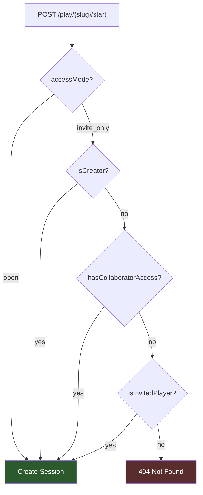

# Feature: Play Link Sharing

Share hunts with players via link. Control access with open/invite-only modes.

> **Documentation rules:** See [DOCUMENTATION-RULES.md](./DOCUMENTATION-RULES.md)

---

## Status

| Layer | Status |
|-------|--------|
| Backend | ✓ Complete |
| Frontend (Editor) | ○ Planned |
| Frontend (Player) | ○ Planned |

**Last Updated:** 2025-01-19 — Backend complete, frontend placeholders

---

## Flow Diagram

```mermaid
sequenceDiagram
    participant U as User
    participant FE as Frontend
    participant API as Backend API
    participant DB as Database

    rect rgb(40, 70, 40)
    Note right of U: EDITOR: SHARE LINK
    U->>FE: [FE ○] SharePanel opens
    FE->>FE: [FE ○] Read hunt.playSlug, accessMode
    FE->>FE: [FE ○] Build URL /play/{slug}
    FE-->>U: [FE ○] Copy link / show QR
    end

    rect rgb(40, 70, 40)
    Note right of U: EDITOR: SET ACCESS MODE
    U->>FE: [FE ○] Toggle "Invite Only"
    FE->>API: [BE ✓] PATCH /hunts/:id/access-mode { accessMode }
    Note right of API: PlayerInvitationService.updateAccessMode()
    API->>DB: [BE ✓] HuntModel.updateOne({ accessMode })
    API-->>FE: [BE ✓] 204 No Content
    end

    rect rgb(40, 70, 40)
    Note right of U: EDITOR: INVITE PLAYER
    U->>FE: [FE ○] Enter player email
    FE->>API: [BE ✓] POST /hunts/:id/player-invitations { email }
    Note right of API: PlayerInvitationService.invitePlayer()
    API->>DB: [BE ✓] PlayerInvitationModel.create()
    API-->>FE: [BE ✓] { invitation }
    end

    rect rgb(40, 70, 40)
    Note right of U: EDITOR: RESET LINK
    U->>FE: [FE ○] Click "Reset Link"
    FE->>API: [BE ✓] POST /hunts/:id/reset-play-link
    Note right of API: HuntService.resetPlayLink()
    API->>DB: [BE ✓] HuntModel.findOneAndUpdate()
    API-->>FE: [BE ✓] { playSlug }
    end

    rect rgb(70, 50, 50)
    Note right of U: PLAYER: START SESSION
    U->>FE: [FE ○] Open /play/{slug}
    FE->>FE: [FE ○] PlayPage extracts slug
    FE->>FE: [FE ○] PlayerIdentification form
    U->>FE: [FE ○] Submit name + email
    FE->>API: [BE ✓] POST /play/{slug}/start
    Note right of API: PlayService.startSession()
    API->>API: [BE ✓] PlayService.checkAccessMode()
    API->>DB: [BE ✓] SessionManager.createSession()
    API-->>FE: [BE ✓] { sessionId, hunt, currentStepId }
    FE->>FE: [FE ○] localStorage.set(sessionId)
    FE->>FE: [FE ○] Render StepRenderer
    end
```



---

## Access Control



**Access priority:**
1. Open mode → anyone can play
2. Creator → always can play their own hunt
3. Collaborator (HuntAccess) → admin/view can play
4. Invited player (PlayerInvitation) → email must match

---

## Code Trace

### Start Session (the complex one)

```
POST /play/{slug}/start { playerName, email? }
│
├─ PlayController.startSession()
│  └─ Extract playSlug, playerName, email from request
│
└─ PlayService.startSession()
   │
   ├─ requireLiveHuntBySlug(playSlug)
   │  └─ Find hunt by slug, must be live
   │
   ├─ checkAccessMode(hunt, email, userId)  ← KEY LOGIC
   │  ├─ if open → allow
   │  ├─ if isCreator → allow
   │  ├─ if hasCollaboratorAccess → allow
   │  ├─ if isInvitedPlayer → allow
   │  └─ else → 404 Not Found
   │
   ├─ requireHuntVersion(huntId, liveVersion)
   │
   └─ SessionManager.createSession()
      └─ Create progress record

→ Response: { sessionId, hunt, currentStepId, status }
```

### Reset Play Link

```
POST /hunts/:id/reset-play-link
│
├─ HuntController.resetPlayLink()
│
└─ HuntService.resetPlayLink()
   ├─ Require Admin permission
   ├─ Generate new slug (nanoid)
   └─ Update hunt with new playSlug

→ Response: { playSlug }
```

### Invite Player

```
POST /hunts/:id/player-invitations { email }
│
├─ PlayerInvitationController.invitePlayer()
│
└─ PlayerInvitationService.invitePlayer()
   ├─ Require Admin permission
   ├─ Normalize email (lowercase, trim)
   └─ Create PlayerInvitation record

→ Response: 201 { huntId, email, invitedAt }
```

### Update Access Mode

```
PATCH /hunts/:id/access-mode { accessMode }
│
├─ PlayerInvitationController.updateAccessMode()
│
└─ PlayerInvitationService.updateAccessMode()
   ├─ Require Admin permission
   └─ Update hunt.accessMode

→ Response: 204 No Content
```

---

## API Endpoints

| Method | Endpoint | Auth | Purpose |
|--------|----------|------|---------|
| `PATCH` | `/hunts/:id/access-mode` | Required (Admin) | Update accessMode |
| `POST` | `/hunts/:id/reset-play-link` | Required (Admin) | Generate new playSlug |
| `POST` | `/hunts/:id/player-invitations` | Required (Admin) | Invite player by email |
| `GET` | `/hunts/:id/player-invitations` | Required (View) | List invited players |
| `DELETE` | `/hunts/:id/player-invitations/:email` | Required (Admin) | Revoke invitation |
| `POST` | `/play/:slug/start` | Optional | Start play session |

---

## Data Models

### Hunt (updated fields)

```typescript
{
  playSlug: string,      // nanoid(6), unique, immutable unless reset
  accessMode: 'open' | 'invite_only'  // default: 'open'
}
```

### PlayerInvitation (new)

```typescript
{
  huntId: number,
  email: string,         // lowercase, trimmed
  invitedBy: ObjectId,   // user who invited
  invitedAt: Date
}
```

---

## Frontend Implementation Notes

### Editor: SharePanel

```
SharePanel
├── Link display (hunt.playSlug → full URL)
├── Copy button
├── QR code (optional)
├── Access mode toggle (open ↔ invite_only)
├── [If invite_only] InvitationManager
│   ├── Add email input
│   └── List of invited emails (with delete)
└── Reset link button (with confirmation)
```

### Player: Session Start

```
Current: POST /play/{huntId}/start { playerName }
New:     POST /play/{slug}/start { playerName, email? }

- Change route param from huntId to slug
- Add optional email field to PlayerIdentification
- Email required only if hunt is invite_only (can show error from 404)
```

---

## Testing Checklist

### Backend (✓ Done)
- [x] Open mode allows anyone
- [x] Invite-only blocks without email
- [x] Invite-only allows creator
- [x] Invite-only allows collaborators
- [x] Invite-only allows invited emails
- [x] Reset generates new slug
- [x] Old slug stops working after reset

### Frontend (○ TODO)
- [ ] SharePanel displays correct link
- [ ] Access mode toggle updates hunt
- [ ] Invitation CRUD works
- [ ] Reset link with confirmation
- [ ] Player form shows email when needed
- [ ] Error handling for 404 on invite-only

---

## Status Legend

```
[BE ✓] - Backend implemented
[FE ○] - Frontend planned
[FE ✓] - Frontend implemented
```