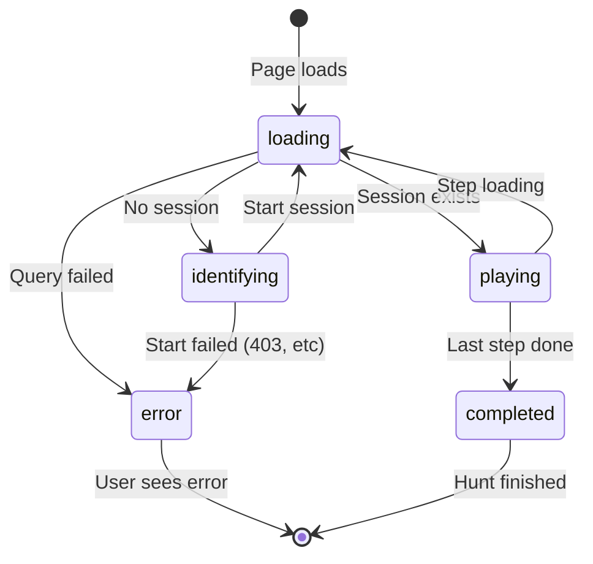

# Feature: Play Session

Manages player session state, step navigation, and data flow in the Player app.

---

## Status

| Layer | Status |
|-------|--------|
| Backend | ✓ Complete |
| Frontend (Player) | ✓ Complete |

---

## Architecture Overview

```
┌─────────────────────────────────────────────────────────────────┐
│                        React Query                               │
│  Source of truth for server data                                │
│                                                                  │
│  • useGetSession(sessionId) → SessionResponse                   │
│  • useStep(sessionId, stepId) → StepResponse (pass-through)     │
│  • useStartSession(playSlug) → mutation                         │
│  • usePrefetchStep(sessionId, nextStepId) → cache warming       │
└─────────────────────────────────────────────────────────────────┘
                              │
                              ▼
┌─────────────────────────────────────────────────────────────────┐
│                    PlaySessionProvider                           │
│  Composes queries, derives status, provides contexts            │
│                                                                  │
│  1. Calls React Query hooks                                     │
│  2. Derives status from query states                            │
│  3. Passes stepResponse through (no transformation)             │
│  4. Creates stable action functions (via refs)                  │
│  5. Provides two contexts:                                      │
│     • SessionStateContext (changes on data updates)             │
│     • SessionActionsContext (stable, never changes)             │
└─────────────────────────────────────────────────────────────────┘
                              │
                    ┌─────────┴─────────┐
                    ▼                   ▼
┌───────────────────────┐   ┌───────────────────────┐
│  SessionStateContext  │   │ SessionActionsContext │
│                       │   │                       │
│  • status             │   │  • startSession()    │
│  • error              │   │  • abandonSession()  │
│  • sessionId          │   │  • advanceToNextStep()│
│  • huntMeta           │   │                       │
│  • stepResponse ←─────│   │  (Memoized, stable)  │
│  • isLastStep         │   │                       │
│                       │   │                       │
│  (stepResponse is     │   │                       │
│   React Query stable  │   │                       │
│   reference)          │   │                       │
└───────────────────────┘   └───────────────────────┘
                              │
                              ▼
┌─────────────────────────────────────────────────────────────────┐
│                      Selector Hooks                              │
│  Derive specific data from stepResponse                         │
│                                                                  │
│  • useCurrentStep() → stepResponse?.step                        │
│  • useStepProgress() → { stepIndex, totalSteps, isLastStep }    │
│  • useStepPlayProgress() → { attempts, hintsUsed, startedAt }   │
└─────────────────────────────────────────────────────────────────┘
```

---

## Session Status Flow



| Status | Meaning | UI State |
|--------|---------|----------|
| `loading` | Fetching session or step | Spinner |
| `error` | Query or mutation failed | Error message with details |
| `identifying` | No session, need player info | PlayerIdentification form |
| `playing` | Active session with current step | StepRenderer |
| `completed` | Hunt finished | Completion screen |

---

## Selector Hooks

Components subscribe only to what they need:

| Hook | Returns | Use Case |
|------|---------|----------|
| `useSessionId()` | `string \| null` | API calls, upload hooks |
| `useSessionStatus()` | `SessionStatus` | Status-based rendering |
| `useSessionError()` | `Error \| null` | Error display |
| `useHuntMeta()` | `HuntMetaPF \| null` | Hunt name display |
| `useIsLastStep()` | `boolean` | "Finish" vs "Continue" button |
| `useStepResponse()` | `StepResponse \| null` | Raw step data (stable ref) |
| `useCurrentStep()` | `StepPF \| null` | Step rendering |
| `useStepProgress()` | `{ currentStepIndex, totalSteps, isLastStep }` | Progress display |
| `useStepPlayProgress()` | `StepPlayProgress \| null` | Time/attempts on resume |
| `useSessionActions()` | `{ startSession, abandonSession, advanceToNextStep }` | User actions |
| `usePreviewHint()` | `string \| undefined` | Editor preview mode |
| `usePlaySession()` | All state + actions | When you need everything |

**Note:** `useStepProgress()` and `useStepPlayProgress()` create new objects on each call. Components typically destructure immediately, so this is fine. If stable references are needed, use `useMemo` in the consumer.

---

## Data Flow: Step Completion

```
User submits correct answer
         │
         ▼
┌─────────────────────────────────────────┐
│ ApiValidationProvider                    │
│                                         │
│ 1. POST /validate → { correct: true }   │
│ 2. Show feedback to user                │
│ 3. User clicks "Continue"               │
│ 4. Call onAdvance() callback            │
└─────────────────────────────────────────┘
         │
         │ onAdvance()
         ▼
┌─────────────────────────────────────────┐
│ PlaySessionProvider.advanceToNextStep() │
│                                         │
│ 1. Read nextStepId from ref             │
│ 2. Update session cache:                │
│    currentStepId = nextStepId           │
│ 3. React Query triggers re-render       │
│ 4. useStep(nextStepId) → CACHE HIT      │
│    (was prefetched)                     │
└─────────────────────────────────────────┘
         │
         ▼
Next step renders instantly
```

---

## Prefetching Strategy

When rendering step N, we prefetch step N+1:

```
useStep(sessionId, currentStepId)     → Current step data
usePrefetchStep(sessionId, nextStepId) → Next step in cache
```

`nextStepId` is extracted from `_links.next` in the step response.

When user advances, the next step is already cached → instant transition.

---

## Player Modes

| Mode | Provider | Data Source |
|------|----------|-------------|
| **Production** (`/play/:slug`) | `PlaySessionProvider` + `ApiValidationProvider` | Backend API |
| **Editor Preview** (iframe) | `EditorPreviewSessionProvider` + `EditorPreviewProvider` | Editor via postMessage |

### Production Mode
- Full session lifecycle
- localStorage persistence
- Backend validation

### Editor Preview Mode
- `sessionId` is null
- Actions are NOOPs
- Mock validation (always success/fail based on mode)
- Components detect preview via `!sessionId && previewHint !== undefined`

---

## Code Trace

### Session Start
```
PlaySessionProvider
├─ sessionStorage.get(playSlug)
│  └─ returns savedSessionId or null
├─ useGetSession(savedSessionId)
│  └─ if null → skipToken (no fetch)
│  └─ if exists → fetch session
├─ deriveStatus(sessionQuery, stepQuery)
│  └─ no session → 'identifying'
└─ User fills form → startSession(name, email)
   └─ startMutation.mutate()
      └─ onSuccess → sessionStorage.set()
```

### Step Navigation
```
PlaySessionProvider
├─ useStep(sessionId, currentStepId)
│  └─ fetch current step + _links
├─ extractStepIdFromLink(_links.next)
│  └─ parse href → nextStepId
├─ usePrefetchStep(sessionId, nextStepId)
│  └─ warm cache for next step
└─ advanceToNextStep()
   └─ queryClient.setQueryData()
      ├─ if nextStepId → update currentStepId
      └─ if null → set status = completed
```

---

## API Endpoints

| Method | Endpoint | Purpose |
|--------|----------|---------|
| `POST` | `/play/:playSlug/start` | Start new session |
| `GET` | `/play/sessions/:sessionId` | Get session state |
| `GET` | `/play/sessions/:sessionId/step/:stepId` | Get step data |
| `POST` | `/play/sessions/:sessionId/validate` | Validate answer |
| `POST` | `/play/sessions/:sessionId/hint` | Request hint |

---

## Data Models

```typescript
// SessionState (Frontend context)
{
  status: 'loading' | 'error' | 'identifying' | 'playing' | 'completed',
  error: Error | null,
  sessionId: string | null,
  huntMeta: HuntMetaPF | null,
  currentStep: StepPF | null,
  currentStepIndex: number,
  totalSteps: number,
  isLastStep: boolean,
  previewHint?: string
}

// SessionActions (Frontend context)
{
  startSession: (playerName, email?) => void,
  abandonSession: () => void,
  advanceToNextStep: () => void
}
```

---

## File Structure

```
context/PlaySession/
├── index.ts                         # Public exports
├── SessionContexts.ts               # SessionStatus, SessionState, SessionActions, contexts
├── PlaySessionProvider.tsx          # Main provider
├── EditorPreviewSessionProvider.tsx # Preview mode provider
├── hooks.ts                         # Selector hooks
└── internal/                        # Implementation details
    ├── deriveStatus.ts              # Status derivation helper
    ├── sessionStorage.ts            # localStorage helper
    └── useClearInvalidSession.ts    # Cleanup stale sessions
```

---

## Key Design Decisions

### Split Context
State and actions are separate contexts. Components using only `useSessionActions()` don't rerender when state changes.

### Refs for Stable Actions
`advanceToNextStep` uses refs to read `sessionId` and `nextStepId` at call time, not creation time. This keeps the actions context stable.

### Status Enum Over Booleans
Single `status` enum replaces multiple booleans (`isLoading`, `hasSession`, `isComplete`). Cleaner switch-based rendering.

### Validation Decoupled
`ApiValidationProvider` receives `onAdvance` callback. It doesn't know about session internals—just calls the callback on success.