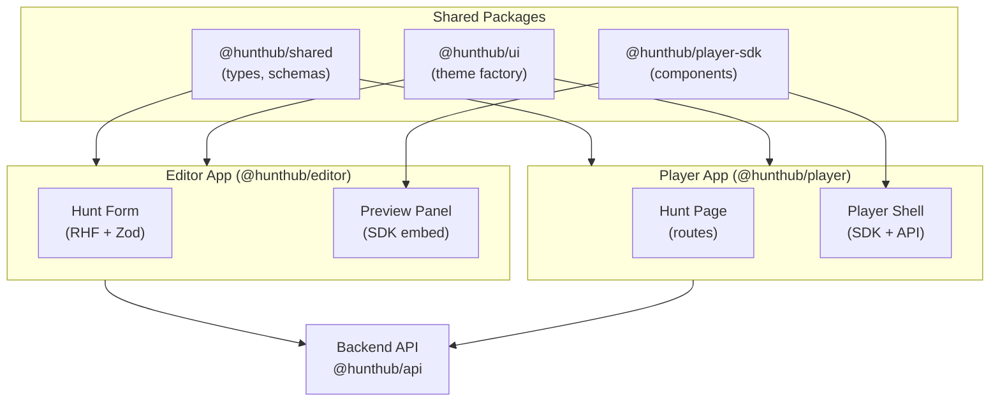
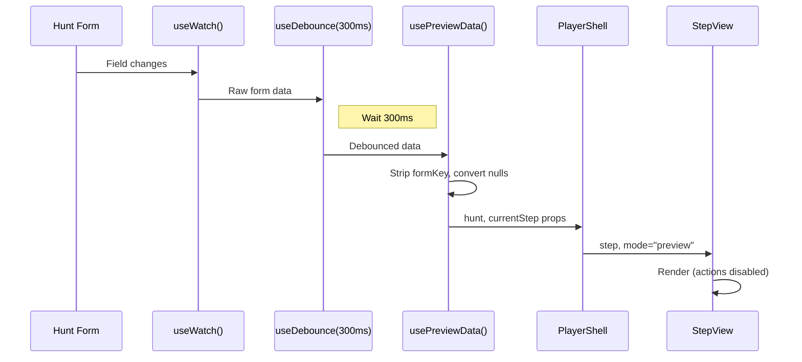
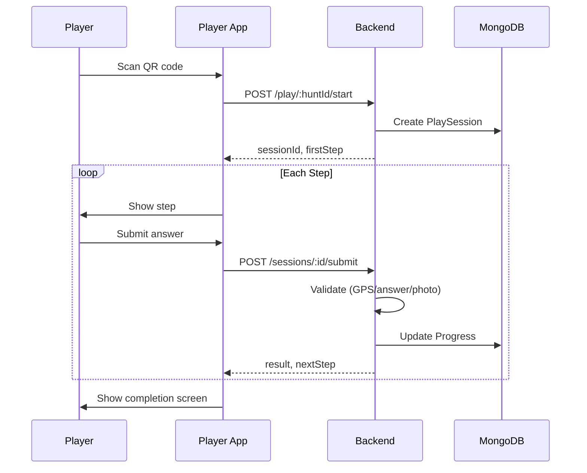

# HuntHub Player Application - Architecture Document

**Created:** 2026-01-04
**Status:** Proposal - Under Review
**Authors:** Development Team

---

## Table of Contents

1. [Overview](#1-overview)
2. [Problem Statement](#2-problem-statement)
3. [Goals & Non-Goals](#3-goals--non-goals)
4. [Architecture Overview](#4-architecture-overview)
5. [Key Components](#5-key-components)
6. [Data Flow](#6-data-flow)
7. [Technology Stack](#7-technology-stack)
8. [Related Documents](#8-related-documents)

---

## 1. Overview

The Player Application enables users to play published treasure hunts. It consists of two parts:

1. **Preview Panel** - Embedded in the Editor for real-time testing
2. **Standalone PWA** - Production player accessed via QR code

Both share the same UI components via `@hunthub/player-sdk`, ensuring visual consistency between what creators see during editing and what players experience.

---

## 2. Problem Statement

### Current State
- Hunt creation (Editor) is complete with forms, validation, and publishing
- No way to preview how a hunt looks to players while editing
- No player-facing application exists

### Desired State
- Creators can see live preview as they edit
- Players can access and complete hunts via mobile browser
- Progress tracked, hints limited, sessions managed

### Key Challenges
1. **Preview Sync** - How to update preview when form changes?
2. **Mode Switching** - Same components behave differently in dev vs production
3. **Code Reuse** - Minimize duplication between preview and player app
4. **Performance** - Don't re-render preview on every keystroke

---

## 3. Goals & Non-Goals

### Goals
- [ ] Live preview in editor (left-right split layout)
- [ ] Standalone PWA player application
- [ ] Shared SDK components between preview and player
- [ ] Progressive enhancement (works without app install)
- [ ] Offline capability (MVP-critical)
- [ ] Session management with localStorage
- [ ] Challenge validation (GPS, quiz answers, photo upload)

### Non-Goals (Not in MVP)
- Native mobile app (React Native)
- Real-time multiplayer
- Leaderboards and scoring
- AI-based validation (photo/text analysis)
- Push notifications

---

## 4. Architecture Overview



---

## 5. Key Components

### 5.1 Player SDK (`@hunthub/player-sdk`)

Reusable React components for rendering hunt steps.

```
packages/player-sdk/
├── src/
│   ├── components/
│   │   ├── PlayerShell.tsx       # Main container + theme
│   │   ├── StepView.tsx          # Step type discriminator
│   │   ├── steps/
│   │   │   ├── LocationStep.tsx  # GPS-based challenge
│   │   │   ├── QuizStep.tsx      # Multiple choice / text input
│   │   │   ├── PhotoStep.tsx     # Photo capture + upload
│   │   │   └── TaskStep.tsx      # Text submission
│   │   ├── ProgressIndicator.tsx
│   │   └── CompletionScreen.tsx
│   ├── hooks/
│   │   ├── useGeolocation.ts     # GPS tracking
│   │   └── useCamera.ts          # MediaDevices API
│   ├── context/
│   │   └── PlayerContext.tsx     # Mode + config provider
│   └── index.ts
```

### 5.2 Preview Panel (in Editor)

Embeds SDK components with preview mode configuration.

```tsx
// apps/frontend/editor/src/pages/Hunt/components/PreviewPanel.tsx

const PreviewPanel = () => {
  const formData = useWatch({ control });         // Form state
  const debouncedData = useDebounce(formData, 300); // Prevent spam
  const previewData = usePreviewData(debouncedData); // Transform

  return (
    <PlayerShell mode="preview" theme={adventureTheme}>
      <StepView
        step={previewData.currentStep}
        onSubmit={() => {}} // Disabled in preview
      />
    </PlayerShell>
  );
};
```

### 5.3 Player App (`@hunthub/player`)

Standalone PWA with routes and API integration.

```
apps/frontend/player/
├── src/
│   ├── pages/
│   │   ├── HuntPage/           # Main play screen
│   │   ├── CompletePage/       # Hunt completed
│   │   └── NotFoundPage/
│   ├── api/
│   │   ├── startHunt.ts        # POST /play/:id/start
│   │   ├── submitAnswer.ts     # POST /sessions/:id/submit
│   │   └── requestHint.ts      # POST /sessions/:id/hint
│   ├── hooks/
│   │   └── useSession.ts       # localStorage session management
│   ├── theme/
│   │   └── adventure.ts        # Player-specific colors
│   └── App.tsx
```

---

## 6. Data Flow

### 6.1 Editor Preview Flow



**Why 300ms debounce?**
- Catalyst uses this value in production
- Fast enough to feel responsive
- Slow enough to prevent excessive updates

### 6.2 Production Player Flow



---

## 7. Technology Stack

| Layer | Technology | Why |
|-------|------------|-----|
| **Framework** | React 19 PWA | Same as editor, maximum code sharing |
| **Styling** | MUI + styled-components | Consistent with editor |
| **State** | React Query + Zustand | Server + UI state separation |
| **Forms** | React Hook Form | Editor already uses this |
| **Validation** | Zod | Shared schemas |
| **GPS** | Geolocation API | Browser-native, no library needed |
| **Camera** | MediaDevices API | Browser-native |
| **Offline** | Service Worker | PWA standard |

### Why PWA (not React Native)?

| Criteria | PWA | React Native |
|----------|-----|--------------|
| Time to market | Faster | Slower |
| Code sharing | Maximum | Moderate |
| QR access | Direct (browser) | Requires app download |
| GPS accuracy | Good enough | Better |
| Camera | Good | Excellent |
| Offline | Service Worker | Native |
| Bundle size | Shared with editor | Separate |

**Decision:** PWA is sufficient for MVP. Can wrap in Capacitor later if native features needed.

---

## 8. Related Documents

- [Architecture Decisions (ADRs)](./decisions/) - Individual decision records
- [Preview Implementation Details](./PREVIEW-SYNC.md) - How preview sync works
- [Mode Configuration](./PLAYER-MODES.md) - Dev vs production behavior
- [Player API Design](../guides/player-api-design.md) - Backend endpoints

---

## Changelog

| Date | Author | Changes |
|------|--------|---------|
| 2026-01-04 | AI | Initial architecture proposal |

---

**Next Steps:**
1. Review this document
2. Approve/modify architecture decisions
3. Begin Phase 1 implementation (packages/ui)
