# Player Modes - Preview vs Production

**Related ADR:** [002](./decisions/002-mode-prop-pattern.md)

---

## Overview

The Player SDK components support two modes:

1. **Preview Mode** - Used in Editor for testing
2. **Production Mode** - Used in Player App for real gameplay

---

## Mode Comparison

```mermaid
flowchart TB
    subgraph Preview["PREVIEW MODE (Editor Preview Panel)"]
        direction TB
        P1["Data Source: Form State (React Hook Form)"]
        P2["Session: None"]
        P3["Progress: Visual only (not saved)"]
        P4["Navigation: Free (can jump to any step)"]
        P5["Hints: Always visible (for testing)"]
        P6["Answers: Shown (can see correct answers)"]
        P7["GPS: Mock/bypass (no real location check)"]
        P8["Photo: Optional (can skip)"]
        P9["Actions: Disabled (can't submit)"]
    end

    subgraph Production["PRODUCTION MODE (Player PWA App)"]
        direction TB
        R1["Data Source: Backend API"]
        R2["Session: localStorage sessionId"]
        R3["Progress: Saved to database"]
        R4["Navigation: Sequential only (must complete step)"]
        R5["Hints: Limited (3 per step)"]
        R6["Answers: Hidden (security)"]
        R7["GPS: Real validation (within radius)"]
        R8["Photo: Required (must upload)"]
        R9["Actions: Enabled (full functionality)"]
    end
```



---

## Behavior Matrix

| Behavior | Preview | Production | Notes |
|----------|---------|------------|-------|
| **Data Source** | Form state | API | Different data pipelines |
| **Session ID** | None | localStorage | Production tracks sessions |
| **Save Progress** | No | Yes | Production persists to DB |
| **Navigation** | Free | Sequential | Preview allows step jumping |
| **Show Hints** | Always | On request | Preview shows for testing |
| **Show Answers** | Yes | No | Preview shows for testing |
| **Validate GPS** | No | Yes | Preview skips location check |
| **Require Photo** | No | Yes | Preview allows skip |
| **Track Analytics** | No | Yes | Production logs events |
| **Submit Button** | Disabled | Enabled | Preview is view-only |
| **Hint Counter** | Hidden | Visible | Production shows remaining |

---

## Implementation

### PlayerContext

```tsx
// packages/player-sdk/src/context/PlayerContext.tsx

export type PlayerMode = 'preview' | 'production';

export interface PlayerConfig {
  mode: PlayerMode;

  // Override defaults per mode
  showAnswers?: boolean;
  skipValidation?: boolean;
  freeNavigation?: boolean;
  mockLocation?: Location;
}

interface PlayerContextValue {
  mode: PlayerMode;
  config: PlayerConfig;

  // Computed helpers
  shouldValidate: boolean;
  canNavigateFreely: boolean;
  showCorrectAnswers: boolean;
  hintsEnabled: boolean;
  actionsEnabled: boolean;
}

const PlayerContext = createContext<PlayerContextValue | null>(null);

export const usePlayerContext = () => {
  const context = useContext(PlayerContext);
  if (!context) {
    throw new Error('usePlayerContext must be used within PlayerShell');
  }
  return context;
};
```

### PlayerShell Component

```tsx
// packages/player-sdk/src/components/PlayerShell.tsx

interface PlayerShellProps {
  mode: PlayerMode;
  theme?: Theme;
  children: React.ReactNode;

  // Config overrides
  showAnswers?: boolean;
  skipValidation?: boolean;
  freeNavigation?: boolean;
  mockLocation?: Location;
}

export const PlayerShell = ({
  mode,
  theme = defaultPlayerTheme,
  children,
  ...configOverrides
}: PlayerShellProps) => {

  const value = useMemo<PlayerContextValue>(() => {
    const config: PlayerConfig = { mode, ...configOverrides };

    return {
      mode,
      config,

      // Compute helpers based on mode + overrides
      shouldValidate: mode === 'production' && !config.skipValidation,
      canNavigateFreely: mode === 'preview' || config.freeNavigation,
      showCorrectAnswers: mode === 'preview' || config.showAnswers,
      hintsEnabled: mode === 'production',
      actionsEnabled: mode === 'production',
    };
  }, [mode, configOverrides]);

  return (
    <PlayerContext.Provider value={value}>
      <ThemeProvider theme={theme}>
        {children}
      </ThemeProvider>
    </PlayerContext.Provider>
  );
};
```

### Usage in StepView

```tsx
// packages/player-sdk/src/components/StepView.tsx

export const StepView = ({ step, onSubmit }: StepViewProps) => {
  const { shouldValidate, showCorrectAnswers, actionsEnabled } = usePlayerContext();

  const handleSubmit = (answer: unknown) => {
    if (actionsEnabled) {
      onSubmit?.(answer);
    } else {
      console.log('[Preview] Submission disabled:', answer);
    }
  };

  return (
    <S.Container>
      {/* Render based on step type */}
      {step.type === 'quiz' && (
        <QuizStep
          quiz={step.challenge.quiz}
          onSubmit={handleSubmit}
          showAnswer={showCorrectAnswers}
          disabled={!actionsEnabled}
        />
      )}

      {step.type === 'clue' && (
        <LocationStep
          clue={step.challenge.clue}
          location={step.requiredLocation}
          onArrive={handleSubmit}
          skipValidation={!shouldValidate}
        />
      )}

      {/* ... other step types */}
    </S.Container>
  );
};
```

---

## Mode-Specific Behavior

### Location Validation

```tsx
// packages/player-sdk/src/components/steps/LocationStep.tsx

const LocationStep = ({ location, onArrive, skipValidation }) => {
  const { coords } = useGeolocation();
  const { shouldValidate, config } = usePlayerContext();

  const checkLocation = () => {
    if (!shouldValidate || skipValidation) {
      // Preview mode: always succeed
      onArrive();
      return;
    }

    // Production mode: check actual distance
    const distance = calculateDistance(
      coords,
      config.mockLocation || location
    );

    if (distance <= location.radius) {
      onArrive();
    } else {
      showError(`You're ${distance}m away. Get within ${location.radius}m.`);
    }
  };

  return (
    <S.Container>
      <LocationInfo location={location} />

      {shouldValidate && <DistanceDisplay distance={currentDistance} />}

      <Button onClick={checkLocation} disabled={!coords}>
        {shouldValidate ? 'Check Location' : 'Continue (Preview)'}
      </Button>
    </S.Container>
  );
};
```

### Quiz Answer Display

```tsx
// packages/player-sdk/src/components/steps/QuizStep.tsx

const QuizStep = ({ quiz, onSubmit, showAnswer, disabled }) => {
  const [selected, setSelected] = useState<string | null>(null);
  const [submitted, setSubmitted] = useState(false);

  return (
    <S.Container>
      <QuestionText>{quiz.title}</QuestionText>

      <OptionsList>
        {quiz.options.map(option => (
          <OptionButton
            key={option.id}
            selected={selected === option.id}
            correct={showAnswer && option.id === quiz.target.id}
            onClick={() => !disabled && setSelected(option.id)}
          >
            {option.text}
            {showAnswer && option.id === quiz.target.id && (
              <CorrectBadge>✓ Correct</CorrectBadge>
            )}
          </OptionButton>
        ))}
      </OptionsList>

      <SubmitButton
        onClick={() => onSubmit(selected)}
        disabled={disabled || !selected}
      >
        {disabled ? 'Preview Only' : 'Submit Answer'}
      </SubmitButton>
    </S.Container>
  );
};
```

### Hint System

```tsx
// packages/player-sdk/src/components/HintButton.tsx

const HintButton = ({ hint, stepId }) => {
  const { mode, hintsEnabled } = usePlayerContext();
  const [hintsUsed, setHintsUsed] = useState(0);
  const maxHints = 3;

  if (mode === 'preview') {
    // Preview: always show hint
    return (
      <S.HintBox>
        <S.HintLabel>Hint (always visible in preview)</S.HintLabel>
        <S.HintText>{hint}</S.HintText>
      </S.HintBox>
    );
  }

  // Production: limited hints
  const remaining = maxHints - hintsUsed;

  const handleRequest = async () => {
    if (remaining <= 0) return;

    const response = await requestHint(stepId);
    setHintsUsed(prev => prev + 1);
    setRevealedHint(response.hint);
  };

  return (
    <S.Container>
      <S.HintButton onClick={handleRequest} disabled={remaining <= 0}>
        {remaining > 0
          ? `Request Hint (${remaining} left)`
          : 'No hints remaining'
        }
      </S.HintButton>

      {revealedHint && <S.HintText>{revealedHint}</S.HintText>}
    </S.Container>
  );
};
```

---

## Usage Examples

### Editor Preview Panel

```tsx
// apps/frontend/editor/src/pages/Hunt/components/PreviewPanel.tsx

<PlayerShell
  mode="preview"
  theme={playerTheme}
  showAnswers={true}
  freeNavigation={true}
>
  <ProgressIndicator current={currentIndex} total={totalSteps} />
  <StepView step={currentStep} />
</PlayerShell>
```

### Player App

```tsx
// apps/frontend/player/src/pages/HuntPage.tsx

<PlayerShell mode="production" theme={playerTheme}>
  <ProgressIndicator current={progress.currentStep} total={progress.total} />
  <StepView
    step={currentStep}
    onSubmit={handleSubmit}
  />
  <HintButton hint={currentStep.hint} stepId={currentStep.stepId} />
</PlayerShell>
```

### Testing with Mock Location

```tsx
// For testing in player app with fake location

<PlayerShell
  mode="production"
  mockLocation={{ lat: 41.403, lng: 2.174 }}
>
  <StepView step={currentStep} onSubmit={handleSubmit} />
</PlayerShell>
```

---

## Summary

The mode prop pattern provides:

1. **Single codebase** - Same components for both uses
2. **Clear configuration** - Mode explicitly controls behavior
3. **Testability** - Can test both modes easily
4. **Flexibility** - Config overrides for special cases

This is simpler than having separate components and ensures visual consistency between preview and production.