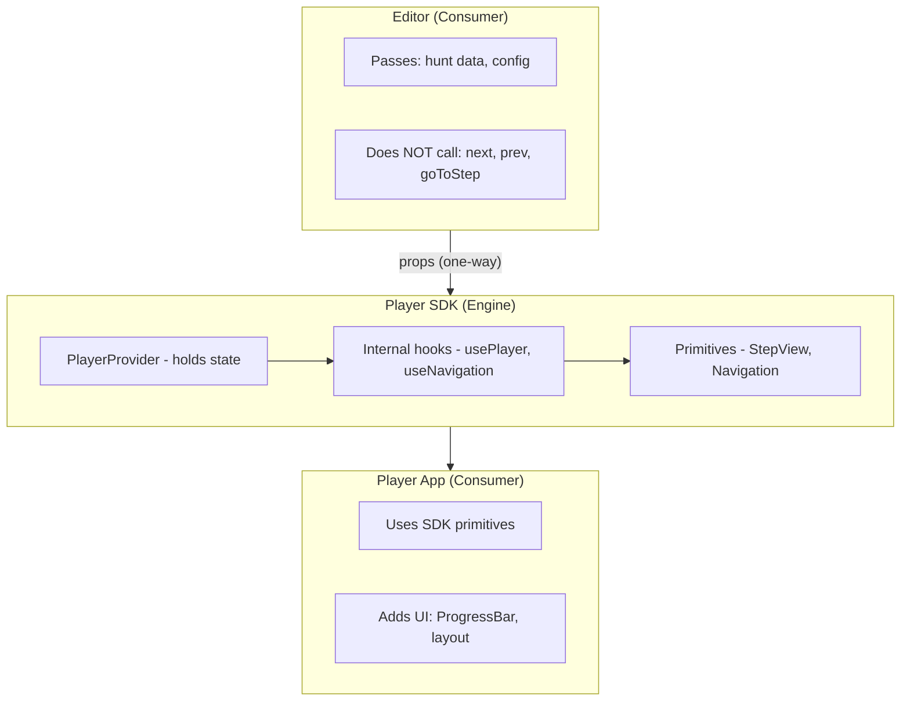

# @hunthub/player-sdk

**Status:** Planned (POC first, extend later)
**Purpose:** Player engine - state management, logic, primitive components

---

## What It Is

The SDK is the **engine** for playing hunts. It handles:
- State management (current step, progress)
- Navigation logic (can go next? validation passed?)
- Primitive components (StepView, Navigation)

The SDK does **NOT** decide:
- Visual styling (that's `@hunthub/compass`)
- UI layout choices (that's the consuming app)

---

## Communication Flow



**One-way communication:** Editor → SDK. The SDK takes control.

---

## SDK Config (Admin Controls)

What the consumer passes to control behavior:

```typescript
interface SDKConfig {
  mode: 'preview' | 'production';
  selectedStepIndex?: number;      // Control from outside
  freeNavigation?: boolean;        // Can skip steps?
  enableValidation?: boolean;      // Validate answers?
  onStepChange?: (index: number) => void;  // Notify consumer
}
```

---

## Structure

```
packages/player-sdk/
├── src/
│   ├── context/
│   │   └── PlayerContext.tsx      # Core state
│   │
│   ├── hooks/                     # INTERNAL use
│   │   ├── usePlayer.ts           # goToStep, reset
│   │   ├── useCurrentStep.ts      # Current step data
│   │   └── useNavigation.ts       # next, prev, canGoNext
│   │
│   ├── components/
│   │   ├── PlayerProvider.tsx     # Wraps everything
│   │   ├── StepView.tsx           # Renders current step
│   │   ├── Navigation.tsx         # Prev/Next buttons
│   │   └── steps/
│   │       ├── LocationStep.tsx
│   │       ├── QuizStep.tsx
│   │       ├── PhotoStep.tsx
│   │       └── TaskStep.tsx
│   │
│   ├── types/
│   │   └── index.ts
│   │
│   └── index.ts
```

---

## Exports

```typescript
// Components (for consumers)
export { PlayerProvider } from './components/PlayerProvider';
export { StepView } from './components/StepView';
export { Navigation } from './components/Navigation';

// Types
export type { SDKConfig, PlayerState } from './types';

// Hooks - exported but primarily for internal/advanced use
export { usePlayer } from './hooks/usePlayer';
export { useCurrentStep } from './hooks/useCurrentStep';
export { useNavigation } from './hooks/useNavigation';
```

---

## Usage

### Player App (production)

```tsx
import { PlayerProvider, StepView, Navigation } from '@hunthub/player-sdk';

const PlayPage = ({ hunt }) => (
  <PlayerProvider
    hunt={hunt}
    config={{ mode: 'production' }}
  >
    <ProgressBar />       {/* Player's UI choice */}
    <StepView />          {/* SDK primitive */}
    <HintsButton />       {/* Player's UI choice */}
    <Navigation />        {/* SDK primitive */}
  </PlayerProvider>
);
```

### Editor Preview (controlled)

```tsx
import { PlayerProvider, StepView } from '@hunthub/player-sdk';

const PreviewPanel = ({ formData, selectedStepIndex }) => (
  <PlayerProvider
    hunt={formData}
    config={{
      mode: 'preview',
      selectedStepIndex,           // Sync with editor
      freeNavigation: true,
    }}
  >
    <StepView />                   {/* Minimal UI */}
  </PlayerProvider>
);
```

Editor passes config. SDK handles the rest.

---

## Hooks Are Internal

The hooks are used BY SDK components, not by Editor.

```tsx
// Inside SDK's Navigation.tsx
const Navigation = () => {
  const { next, prev, canGoNext } = useNavigation(); // Internal

  return (
    <>
      <Button onClick={prev}>Back</Button>
      <Button onClick={next} disabled={!canGoNext}>Next</Button>
    </>
  );
};
```

Consumer doesn't call `next()`. The `Navigation` component does.

---

## POC Scope

Start minimal, extend later:

**POC includes:**
- [ ] PlayerProvider with basic state
- [ ] StepView (renders step content)
- [ ] Navigation (prev/next)
- [ ] mode: preview/production
- [ ] selectedStepIndex control

**Later:**
- [ ] Step type components (Location, Quiz, Photo, Task)
- [ ] Validation logic
- [ ] Hints system
- [ ] Progress tracking
- [ ] GPS/Camera hooks

---

## Relationship to Other Packages

```
@hunthub/compass      → Styling (theme, tokens)
@hunthub/player-sdk   → Engine (state, logic, primitives)
@hunthub/shared       → Types, schemas

Player App = compass + player-sdk + app-specific UI
Editor Preview = compass + player-sdk (minimal UI)
```
