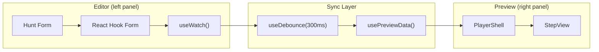

# Preview Synchronization - Technical Details

**Related ADRs:** [001](./decisions/001-sdk-over-iframe.md), [004](./decisions/004-debounced-preview.md)

---

## Overview

This document explains how form changes in the Editor propagate to the Preview panel in real-time.

---

## Data Flow Diagram



---

## Implementation

### Step 1: Form Setup

The hunt form uses React Hook Form with Zod validation.

```tsx
// apps/frontend/editor/src/pages/Hunt/HuntLayout.tsx

const methods = useForm<HuntFormData>({
  resolver: zodResolver(HuntFormDataSchema),
  values: hunt ? transformHuntToForm(hunt) : undefined,
  defaultValues: defaultHuntFormData,
});

return (
  <FormProvider {...methods}>
    <HuntEditor />
  </FormProvider>
);
```

### Step 2: Watch Form Data

The preview panel watches the entire form state.

```tsx
// apps/frontend/editor/src/pages/Hunt/components/PreviewPanel/PreviewPanel.tsx

import { useFormContext, useWatch } from 'react-hook-form';

const PreviewPanel = () => {
  const { control } = useFormContext<HuntFormData>();

  // Watch entire form - triggers on any field change
  const formData = useWatch({ control });

  // ...
};
```

### Step 3: Debounce Updates

Debounce prevents excessive re-renders during rapid typing.

```tsx
import { useDebounce } from '@/hooks/useDebounce';

const PreviewPanel = () => {
  const formData = useWatch({ control });

  // Wait 300ms after last change before updating
  const debouncedData = useDebounce(formData, 300);

  // ...
};
```

### Step 4: Transform to Player Format

Transform form data to the format expected by player components.

```tsx
const PreviewPanel = () => {
  // ...

  const previewData = usePreviewData(debouncedData, selectedStepIndex);

  // ...
};
```

#### usePreviewData Hook

```tsx
// apps/frontend/editor/src/pages/Hunt/hooks/usePreviewData.ts

interface PreviewData {
  hunt: PreviewHunt;
  currentStep: PreviewStep | null;
  totalSteps: number;
  currentStepIndex: number;
}

export const usePreviewData = (
  formData: HuntFormData | undefined,
  selectedStepIndex: number
): PreviewData | null => {

  return useMemo(() => {
    if (!formData) return null;

    // Strip formKey and other editor-only fields
    const hunt: PreviewHunt = {
      name: formData.name,
      description: formData.description,
      coverImage: formData.coverImage,
    };

    // Get selected step (or first step)
    const stepIndex = selectedStepIndex ?? 0;
    const formStep = formData.steps?.[stepIndex];

    if (!formStep) return { hunt, currentStep: null, totalSteps: 0, currentStepIndex: 0 };

    // Transform step to player format
    const currentStep: PreviewStep = {
      stepId: formStep.stepId ?? -1, // Negative for unsaved
      type: formStep.type,
      challenge: transformChallenge(formStep.type, formStep.challenge),
      media: formStep.media,
      hint: formStep.hint,
      requiredLocation: formStep.requiredLocation,
    };

    return {
      hunt,
      currentStep,
      totalSteps: formData.steps?.length ?? 0,
      currentStepIndex: stepIndex,
    };
  }, [formData, selectedStepIndex]);
};
```

### Step 5: Render Preview

Pass transformed data to SDK components.

```tsx
import { PlayerShell, StepView, ProgressIndicator } from '@hunthub/player-sdk';
import { playerTheme } from '@/theme/player';

const PreviewPanel = () => {
  const formData = useWatch({ control });
  const debouncedData = useDebounce(formData, 300);
  const previewData = usePreviewData(debouncedData, selectedStepIndex);

  if (!previewData) {
    return <EmptyPreview />;
  }

  return (
    <S.PreviewContainer>
      <PlayerShell mode="preview" theme={playerTheme}>
        <ProgressIndicator
          current={previewData.currentStepIndex}
          total={previewData.totalSteps}
        />

        {previewData.currentStep ? (
          <StepView
            step={previewData.currentStep}
            onSubmit={() => {}} // Disabled in preview
          />
        ) : (
          <NoStepsMessage />
        )}
      </PlayerShell>
    </S.PreviewContainer>
  );
};
```

---

## Performance Optimizations

### 1. Debouncing (Primary)

```tsx
const debouncedData = useDebounce(formData, 300);
```

**Effect:** Reduces transform calls from ~10/second to ~3/second during typing.

### 2. Memoization

```tsx
const previewData = useMemo(
  () => transformToPreview(debouncedData, selectedStepIndex),
  [debouncedData, selectedStepIndex]
);
```

**Effect:** Prevents recalculation if inputs haven't changed.

### 3. Component Memoization

```tsx
// In @hunthub/player-sdk
export const StepView = memo(({ step, onSubmit }) => {
  // Only re-render if step object changes
});
```

**Effect:** Prevents re-render if same step object reference.

### 4. Selective Watching (Optional)

If performance is still an issue, watch only specific fields:

```tsx
const { name, description } = useWatch({
  control,
  name: ['name', 'description'],
});

const currentStep = useWatch({
  control,
  name: `steps.${selectedStepIndex}`,
});
```

**Effect:** Only triggers when watched fields change.

---

## Edge Cases

### 1. Empty Form

```tsx
if (!previewData?.currentStep) {
  return <EmptyState message="Add a step to see preview" />;
}
```

### 2. Step Deleted

When a step is deleted, `selectedStepIndex` might be out of bounds.

```tsx
const safeIndex = Math.min(
  selectedStepIndex,
  (formData.steps?.length ?? 1) - 1
);
```

### 3. Rapid Step Switching

When user clicks through steps quickly, debounce is bypassed.

```tsx
// Step selection is immediate, not debounced
const handleStepSelect = (index: number) => {
  setSelectedStepIndex(index); // Immediate update
};
```

### 4. Large Media

Media (images, audio) should not be in the debounced flow.

```tsx
// Media URLs are already stable - no transform needed
currentStep.media = formStep.media; // Pass through
```

---

## Comparison with Efekta Catalyst

| Aspect | Catalyst | HuntHub |
|--------|----------|---------|
| **Communication** | postMessage | Direct props |
| **Transform location** | Backend API | Client-side hook |
| **Debounce time** | 300ms | 300ms |
| **Framework** | React → Angular | React → React |

**Why different approach?**

Catalyst uses iframe + postMessage because:
- Editor is React, Player is Angular
- Complete isolation required for enterprise

HuntHub uses direct props because:
- Both are React
- Simpler is better for portfolio project
- Same performance, less complexity

---

## Testing

### Unit Tests

```tsx
// usePreviewData.test.ts

it('transforms form data to preview format', () => {
  const formData = {
    name: 'Test Hunt',
    steps: [{ type: 'quiz', challenge: { quiz: {...} } }]
  };

  const result = usePreviewData(formData, 0);

  expect(result.hunt.name).toBe('Test Hunt');
  expect(result.currentStep.type).toBe('quiz');
});

it('handles empty steps', () => {
  const formData = { name: 'Test', steps: [] };

  const result = usePreviewData(formData, 0);

  expect(result.currentStep).toBeNull();
});
```

### Integration Tests

```tsx
// PreviewPanel.test.tsx

it('updates preview when form changes', async () => {
  render(<HuntEditor />);

  // Change name field
  const nameInput = screen.getByLabelText('Hunt Name');
  await userEvent.type(nameInput, 'New Name');

  // Wait for debounce
  await waitFor(() => {
    expect(screen.getByTestId('preview-title')).toHaveTextContent('New Name');
  }, { timeout: 400 });
});
```

---

## Debugging

### React DevTools

1. Open React DevTools
2. Search for "PreviewPanel"
3. Check "Highlight updates when components render"
4. Type in form - should see preview update after pause

### Console Logging

```tsx
const debouncedData = useDebounce(formData, 300);

useEffect(() => {
  console.log('[Preview] Debounced data updated:', debouncedData);
}, [debouncedData]);
```

### Performance Profiler

1. Open React DevTools Profiler
2. Start recording
3. Type rapidly in form
4. Stop recording
5. Check for excessive re-renders

---

## Summary

The preview synchronization uses a simple, effective pattern:

1. **useWatch** - React Hook Form triggers on change
2. **useDebounce** - 300ms delay prevents spam
3. **usePreviewData** - Transform to player format
4. **PlayerShell** - SDK component renders preview

This is simpler than Catalyst's iframe approach because we're React-to-React.