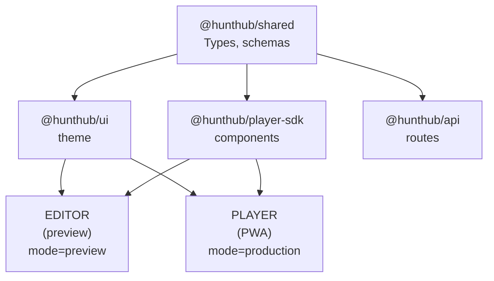

# Player Application - Quick Reference

A one-page summary of the player architecture.

---

## TL;DR



---

## Key Decisions

| Decision | Choice | Why |
|----------|--------|-----|
| **Platform** | React PWA | Same stack, fast time to market |
| **Preview** | SDK Components | React-to-React, no iframe needed |
| **Modes** | mode prop | Same components, different behavior |
| **Sync** | 300ms debounce | Responsive but performant |
| **Theme** | Shared factory | Consistent tokens, different palettes |

---

## New Packages

| Package | Purpose | Key Exports |
|---------|---------|-------------|
| `@hunthub/ui` | Theme infrastructure | `createHuntHubTheme()`, tokens |
| `@hunthub/player-sdk` | Player components | `PlayerShell`, `StepView` |

---

## File Structure

```
packages/
├── ui/                    # Theme factory
│   └── src/
│       ├── tokens/        # spacing, typography, shadows
│       └── createTheme.ts # Factory function
│
├── player-sdk/            # Player components
│   └── src/
│       ├── components/    # PlayerShell, StepView, steps/
│       ├── hooks/         # useGeolocation, useCamera
│       └── context/       # PlayerContext

apps/frontend/
├── editor/                # Hunt editor
│   └── src/pages/Hunt/
│       └── components/
│           └── PreviewPanel/  # NEW - embedded preview
│
└── player/                # Player PWA
    └── src/
        ├── pages/         # HuntPage, CompletePage
        ├── api/           # startHunt, submit, hint
        └── theme/         # Adventure palette
```

---

## Mode Comparison

| Feature | Preview | Production |
|---------|---------|------------|
| Data | Form state | API |
| Session | None | localStorage |
| Progress | Visual only | Saved |
| Navigation | Free | Sequential |
| Hints | Visible | Limited (3) |
| Answers | Shown | Hidden |
| GPS | Skipped | Validated |
| Actions | Disabled | Enabled |

---

## Implementation Order

1. **packages/ui** - Theme factory + tokens
2. **Migrate editor theme** - Use new factory
3. **packages/player-sdk** - Components
4. **Preview in editor** - Embed SDK
5. **Player app skeleton** - Routes + theme
6. **Backend API** - PlaySession, endpoints
7. **Connect player to API** - Full flow
8. **PWA features** - Offline, install

---

## Commands

```bash
# Development
npm run dev:editor        # localhost:5173
npm run dev:player        # localhost:5174
npm run dev:api           # localhost:3000

# Build order (packages before apps)
npm run build:shared
npm run build:ui
npm run build:player-sdk
npm run build:editor
npm run build:player
```

---

## Documentation

- [PLAYER-ARCHITECTURE.md](./PLAYER-ARCHITECTURE.md) - Full architecture
- [PREVIEW-SYNC.md](./PREVIEW-SYNC.md) - How preview works
- [PLAYER-MODES.md](./PLAYER-MODES.md) - Preview vs Production
- [decisions/](./decisions/) - ADRs

---

## Questions to Review

Before implementing, confirm:

1. Is left-right split layout correct for preview?
2. Should preview be collapsible or always visible?
3. Adventure theme colors - vibrant or subdued?
4. Any additional preview controls needed?

---

## Next Steps

After approval:

1. Create `packages/ui/` skeleton
2. Move tokens from editor
3. Create `packages/player-sdk/` skeleton
4. Implement `PlayerShell` + `StepView`
5. Add `PreviewPanel` to editor
6. Test preview flow end-to-end