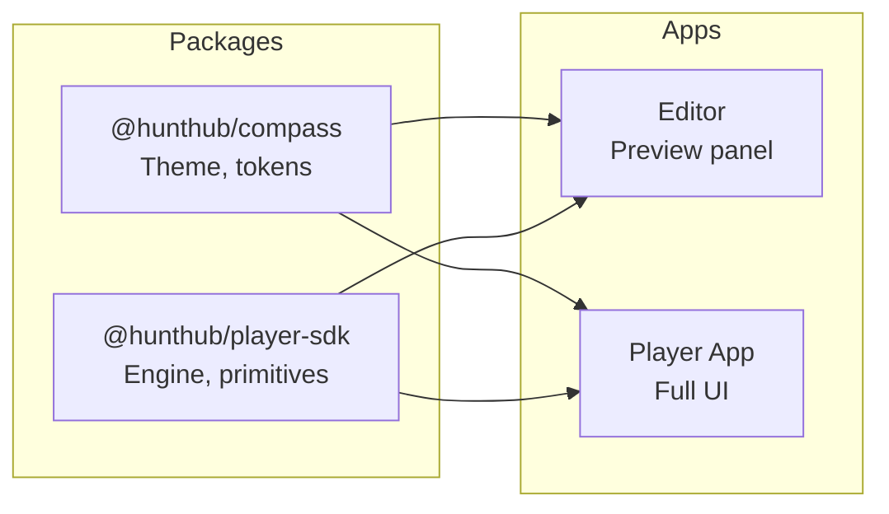
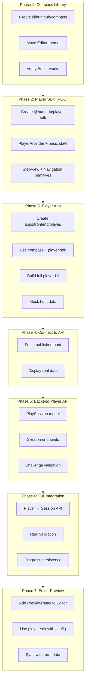

# HuntHub Player Application

**Status:** Ready for Implementation

---

## Architecture



**Key principle:** SDK is the engine. Apps decide the UI.

---

## Build Order



---

## Phase Details

### Phase 1: @hunthub/compass Library

Create the shared design system.

**What:**
- Create `packages/compass/`
- Move tokens, overrides, palettes from Editor
- Export `treasureMapTheme`
- Update Editor to import from compass

**Verify:** Editor still works, no visual changes.

**See:** [COMPASS-LIBRARY.md](./COMPASS-LIBRARY.md)

---

### Phase 2: Player SDK (POC)

Create the player engine.

**What:**
- Create `packages/player-sdk/`
- `PlayerProvider` - context, holds state
- `StepView` - renders current step
- `Navigation` - prev/next buttons
- Internal hooks: `usePlayer`, `useCurrentStep`, `useNavigation`

**Key:** SDK is the engine. Hooks are internal. Consumer just passes config.

**Verify:** Can import and use in a test page

**See:** [PLAYER-SDK.md](./PLAYER-SDK.md)

---

### Phase 3: Player App

Build the player application.

**What:**
- Create `apps/frontend/player/`
- Vite + React 19 + TypeScript
- Use `@hunthub/compass` + `@hunthub/player-sdk`
- Build full player UI around SDK primitives
- Add: ProgressBar, HintsButton, layout
- Use mock hunt data

**Verify:** Can click through steps with mock data

**Dev workflow:**
- Chrome DevTools → device toolbar for mobile view
- Chrome DevTools → Sensors for GPS simulation

---

### Phase 4: Connect to Existing API

Fetch real hunt data.

**What:**
- Fetch published hunt: `GET /api/hunts/:id` (existing endpoint)
- Display real hunt name, description, steps
- Handle loading/error states

**Verify:** Player shows a real published hunt

---

### Phase 5: Backend Player API

Build session and progress tracking.

**What:**
- `PlaySession` model (Mongoose)
- `POST /api/play/:huntId/start` - create session
- `POST /api/play/sessions/:id/submit` - submit answer
- `POST /api/play/sessions/:id/hint` - request hint
- `GET /api/play/sessions/:id` - get session state
- Challenge validators (Location, Quiz, Photo, Task)

**See:** `.claude/guides/player-api-design.md`

**Verify:** API endpoints work via Postman/curl

---

### Phase 6: Full Integration

Connect player to session API.

**What:**
- Player calls start session on load
- Submit answers to API
- Real validation (GPS radius, quiz answers)
- Progress persists across refresh
- Completion screen with stats

**Verify:** Can play a hunt from start to finish

---

### Phase 7: Editor Preview (Later)

Embed player in Editor.

**What:**
- Add `PreviewPanel` to Editor
- Import `HuntPlayer` from player app
- Feed form data instead of API data
- 300ms debounce on form changes
- `mode="preview"` to disable validation

**Verify:** Preview updates as you edit

---

## Quick Reference

| Phase | Creates | Depends On |
|-------|---------|------------|
| 1 | `@hunthub/compass` | - |
| 2 | `@hunthub/player-sdk` | Phase 1 |
| 3 | `apps/frontend/player/` | Phase 1 + 2 |
| 4 | API integration | Phase 3 + existing backend |
| 5 | Backend Player API | - (can parallel with 3-4) |
| 6 | Full player flow | Phase 4 + 5 |
| 7 | Editor preview | Phase 6 |

---

## Development Workflow

```bash
# Terminal 1: Backend
npm run dev:api          # localhost:3000

# Terminal 2: Player
npm run dev:player       # localhost:5174

# Terminal 3: Editor (when needed)
npm run dev:editor       # localhost:5173
```

**Mobile testing:**
- Chrome DevTools → Toggle device toolbar (Ctrl+Shift+M)
- Select iPhone 14 Pro Max or similar

**GPS testing:**
- Chrome DevTools → More tools → Sensors
- Set custom location

---

## Files in This Folder

| File | Purpose |
|------|---------|
| [COMPASS-LIBRARY.md](./COMPASS-LIBRARY.md) | @hunthub/compass - theme library |
| [PLAYER-SDK.md](./PLAYER-SDK.md) | @hunthub/player-sdk - engine library |
| [PLAYER-MODES.md](./PLAYER-MODES.md) | Preview vs Production modes |
| [PREVIEW-SYNC.md](./PREVIEW-SYNC.md) | Form-to-preview sync (Phase 7) |
| [decisions/](./decisions/) | Architecture Decision Records |

---

## Start a New Session

```
I'm working on the HuntHub player application.
Read .claude/player/README.md for context.
Continue with Phase [N].
```