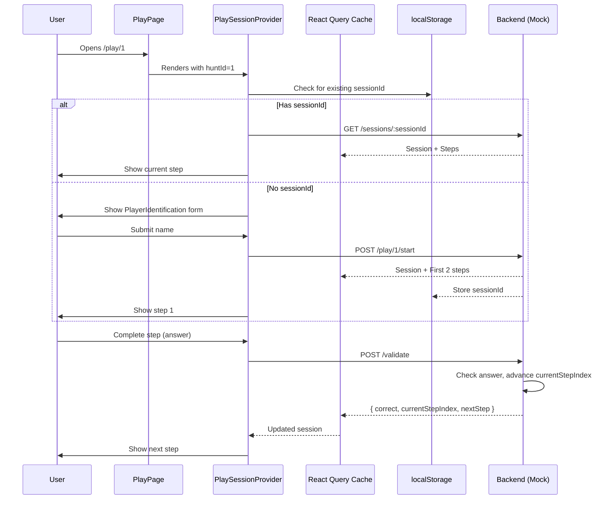
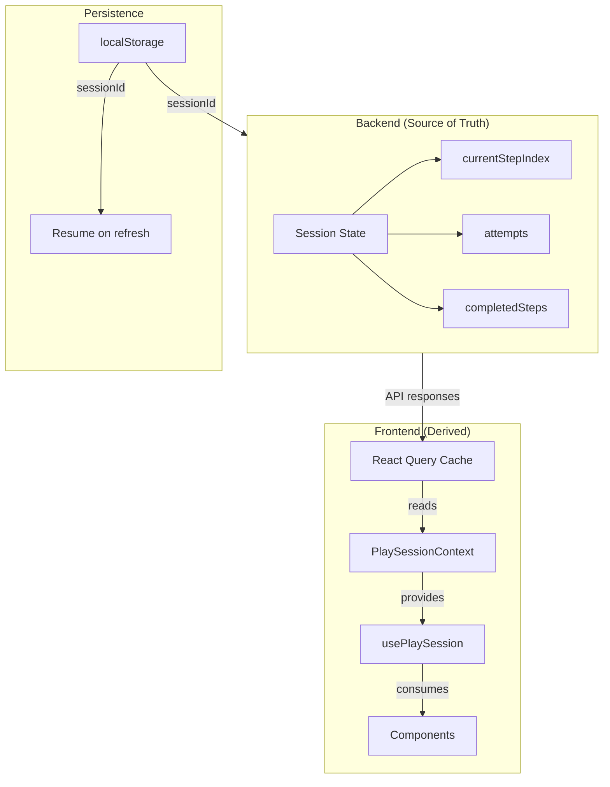
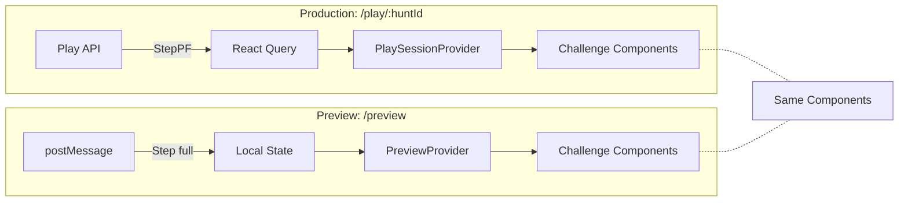

# Player Session Architecture

**Status:** Implemented
**Date:** 2026-01-11

---

## TL;DR

- **BE owns state** → `currentStepIndex`, progress, attempts
- **FE caches** → React Query stores BE responses
- **localStorage** → Persists `sessionId` for resume
- **Context + Hooks** → Clean component API, no prop drilling

---

## File Structure

```
src/
├── api/play/
│   ├── keys.ts              # React Query keys
│   ├── mockData.ts          # Mock BE (session state + validation)
│   ├── useStartSession.ts   # POST /play/:huntId/start
│   ├── useGetSession.ts     # GET /play/sessions/:sessionId
│   └── useValidateAnswer.ts # POST /play/sessions/:sessionId/validate
│
├── context/PlaySession/
│   ├── sessionStorage.ts    # localStorage helper
│   └── PlaySessionContext.tsx # Provider + hooks
│
├── pages/PlayPage/
│   ├── PlayPage.tsx         # Wraps with Provider
│   └── components/
│       ├── PlayerIdentification/  # Start form
│       └── StepRenderer/          # Switch on step.type
│
└── components/challenges/
    └── ClueChallenge/       # POC challenge component
```

---

## Data Flow



---

## State Ownership



**Why BE owns state:**
- Refresh-proof (FE state would reset)
- Can't cheat by manipulating DevTools
- Multi-device consistent (with email)

---

## Component Architecture

```mermaid
flowchart TB
    subgraph PlayPage
        PP[PlayPage.tsx]
        PP --> PSP[PlaySessionProvider]

        subgraph PSP["PlaySessionProvider (Context)"]
            direction TB
            STATUS[status: loading|no_session|active|completed]
            SESSION[sessionId, huntMeta, currentStepIndex]
            ACTIONS[startSession, validateAnswer]
        end

        PSP --> PPC[PlayPageContent]

        PPC --> |status=no_session| PI[PlayerIdentification]
        PPC --> |status=active| SR[StepRenderer]
        PPC --> |status=completed| DONE[Completion Screen]

        SR --> |type=clue| CC[ClueChallenge]
        SR --> |type=quiz| QC[QuizChallenge]
        SR --> |type=mission| MC[MissionChallenge]
    end
```

**Key pattern:** Components use hooks, don't know about session internals.

```tsx
// Component just calls hook - doesn't care where data comes from
const { currentStep, validateAnswer } = usePlaySession();
```

---

## Why This Pattern Works

### 1. Separation of Concerns

| Layer | Responsibility |
|-------|---------------|
| `api/play/` | HTTP calls, caching logic |
| `context/PlaySession/` | Session lifecycle, state derivation |
| `pages/PlayPage/` | Routing, layout |
| `components/challenges/` | Pure UI, receives props |

### 2. React Query as Cache Layer

```tsx
// API hooks populate cache
onSuccess: (data) => {
  queryClient.setQueryData(playKeys.session(huntId), data);
  data.steps.forEach((step, i) => {
    queryClient.setQueryData(playKeys.step(huntId, i), step);
  });
}

// Context reads from cache
const session = queryClient.getQueryData(playKeys.session(huntId));
```

**Benefits:**
- Automatic cache invalidation
- Background refetching
- Optimistic updates ready
- No duplicate state

### 3. Progressive Enhancement (Future-Proof)

```
Level 0: localStorage only     → Same browser resume
Level 1: + email               → Cross-device recovery
Level 2: + auth                → Full user sync
```

Each level adds capability without changing architecture.

---

## Preview + Editor Integration

**The architecture handles both flows cleanly:**



**Why it won't bottleneck:**

| Concern | Solution |
|---------|----------|
| Different data sources | Different providers, same component interface |
| Full vs stripped data | Components accept both (PF is subset of full) |
| Validation | Production: API call / Preview: show answer |
| State management | Production: BE / Preview: local |

**The challenge components don't care:**

```tsx
// Works with both StepPF (production) and Step (preview)
interface ClueChallengeProps {
  clue: CluePF;  // CluePF ⊆ Clue, so Clue works too
  onComplete: () => void;
}
```

---

## Adding New Features

### New Challenge Type
1. Add component in `components/challenges/`
2. Add case in `StepRenderer` switch
3. Done - session logic unchanged

### New Session Feature (hints, scoring)
1. Add to BE response
2. Add to context value
3. Expose via hook
4. Components consume

### Editor Integration
1. Create `PreviewProvider` (different data source)
2. Reuse all challenge components
3. Add editor-specific controls (jump to step, show answer)

---

## Production Patterns Used

| Pattern | Where | Why |
|---------|-------|-----|
| **Provider + Hooks** | PlaySessionContext | Avoids prop drilling, testable |
| **Query Keys Factory** | `playKeys.ts` | Consistent cache keys |
| **Optimistic Updates** | useValidateAnswer | Instant UI feedback |
| **localStorage Persistence** | sessionStorage.ts | Resume capability |
| **Backend as Source of Truth** | currentStepIndex from BE | Prevents cheating, sync issues |
| **Separation: Data vs UI** | api/ vs components/ | Independent evolution |

---

## Quick Reference

### Start Session
```tsx
const { startSession } = usePlaySession();
startSession('Alice', 'alice@email.com');
```

### Get Current Step
```tsx
const { currentStep, currentStepIndex } = usePlaySession();
```

### Validate Answer
```tsx
const { validateAnswer, isValidating } = usePlaySession();
validateAnswer('my-answer');
```

### Check Status
```tsx
const { status } = usePlaySession();
// 'loading' | 'no_session' | 'active' | 'completed' | 'error'
```
