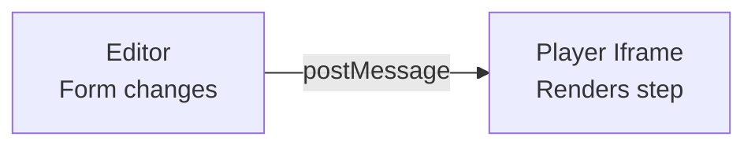
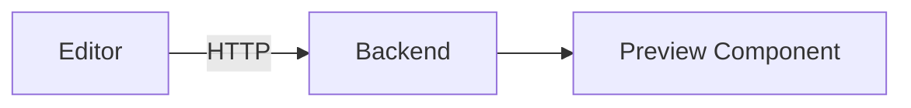

# ADR-001: SDK Components Over Iframe for Preview

**Status:** Proposed
**Date:** 2026-01-04
**Deciders:** Development Team

---

## Context

We need to display a live preview of the hunt while the creator is editing it in the Editor application. There are three main approaches:

1. **Iframe + postMessage** - Embed the Player app in an iframe, communicate via postMessage
2. **SDK Components** - Import player components directly into the Editor
3. **Backend Preview API** - Fetch transformed preview data from backend on each change

### Reference: Efekta Catalyst

Catalyst uses the iframe + postMessage approach because:
- Editor is React, Player is Angular (different frameworks)
- Complete isolation required for legacy Vue/React migration
- Enterprise requirements for security/isolation

---

## Decision

**We will use SDK Components (Option 2).**

The Player SDK (`@hunthub/player-sdk`) will export React components that can be:
- Imported directly into the Editor's preview panel
- Also used in the standalone Player app

```tsx
// In Editor
import { PlayerShell, StepView } from '@hunthub/player-sdk';

<PlayerShell mode="preview">
  <StepView step={currentStep} />
</PlayerShell>
```

---

## Rationale

### Why NOT Iframe + postMessage?

| Factor | Iframe Approach | Our Situation |
|--------|-----------------|---------------|
| Framework mismatch | React → Angular | React → React |
| Serialization needed | Yes | No |
| postMessage complexity | Required | Unnecessary |
| Bundle size | Two separate bundles | Shared code |
| Type safety | Lost at boundary | Full TypeScript |

**Catalyst needs iframes because they cross framework boundaries. We don't.**

### Why NOT Backend Preview API?

| Factor | Issue |
|--------|-------|
| Latency | 50-100ms per request adds up |
| Complexity | Need to handle loading states |
| Backend dependency | Can't preview without server running |
| Overkill | No complex transformation needed |

---

## Consequences

### Positive
- **Simpler architecture** - No postMessage protocol to implement
- **Type safety** - Props are typed, no serialization
- **Performance** - Direct React rendering, no iframe overhead
- **Easier debugging** - Same React tree, same DevTools
- **Smaller bundles** - Shared code between apps

### Negative
- **No complete isolation** - Preview shares React context with Editor
- **Theme leakage possible** - Must be careful with ThemeProvider nesting
- **Can't test "exactly like production"** - Preview is embedded, not standalone

### Mitigation for Negatives
- Use dedicated `PlayerShell` with its own ThemeProvider
- Use `mode` prop to disable production behaviors in preview
- Manual testing in standalone Player app before release

---

## Alternatives Considered

### Option 1: Iframe + postMessage (Rejected)



**Rejected because:** Unnecessary complexity for same-framework apps.

### Option 3: Backend Preview API (Rejected)



**Rejected because:** Adds latency, backend dependency, no real benefit.

---

## Implementation Notes

1. Create `packages/player-sdk/` with shared components
2. Both Editor and Player import from this package
3. `mode` prop controls behavior differences
4. ThemeProvider in `PlayerShell` ensures style isolation

---

## References

- [Efekta Catalyst Preview Implementation](../../../efekta-catalyst/frontend/vue/catalyst/editor-frontend/src/react/views/activity/pages/Activity/ContentPreview/)
- [React Portal documentation](https://react.dev/reference/react-dom/createPortal)
