# ADR-004: Debounced Form-to-Preview Synchronization

**Status:** Accepted
**Date:** 2026-01-04
**Deciders:** Development Team

---

## Architecture Note

This ADR applies to the **postMessage communication** between Editor and Player iframe. The Editor debounces form changes before sending `RENDER_HUNT` messages via the PlayerSDK.

```tsx
// Editor's PreviewPanel uses debounced form data before sending
const debouncedData = useDebounce(formData, 300);

useEffect(() => {
  sdk.renderHunt(debouncedData);
}, [debouncedData]);
```

---

## Context

When a user edits a hunt form field, the preview panel should update to reflect the change. However, updating on every keystroke causes:

1. **Performance issues** - Excessive re-renders
2. **Visual noise** - Preview flickering during typing
3. **Wasted computation** - Intermediate states not useful

---

## Decision

**Use a 300ms debounce on form-to-preview synchronization.**

```tsx
const formData = useWatch({ control }); // React Hook Form
const debouncedData = useDebounce(formData, 300); // Wait 300ms
const previewData = usePreviewData(debouncedData); // Transform
```

---

## Rationale

### Why 300ms?

| Debounce Time | Experience |
|---------------|------------|
| 0ms (immediate) | Laggy, every keystroke triggers update |
| 100ms | Still too frequent, may feel jittery |
| **300ms** | Feels responsive, updates after typing pauses |
| 500ms | Noticeable delay, feels slow |
| 1000ms | Too slow, poor UX |

**300ms is the Catalyst default** - proven in production with similar editing workflows.

### How It Works

```mermaid
gantt
    title Debounce Timeline (User types "Hello")
    dateFormat X
    axisFormat %L ms

    section Without Debounce
    H typed     :0, 100
    e typed     :100, 200
    l typed     :200, 300
    l typed     :300, 400
    o typed     :400, 500

    section With 300ms Debounce
    Typing      :0, 500
    Debounce wait :500, 800
    Update fires  :milestone, 800, 0
```



**Without debounce:** 5 preview updates
**With 300ms debounce:** 1 preview update (at ~800ms)

---

## Implementation

### Option A: useDebounce Hook (Recommended)

```tsx
import { useDebounce } from '@/hooks/useDebounce';

const PreviewPanel = () => {
  const formData = useWatch({ control });
  const debouncedData = useDebounce(formData, 300);

  const previewData = useMemo(
    () => transformToPreview(debouncedData),
    [debouncedData]
  );

  return (
    <PlayerShell mode="preview">
      <StepView step={previewData.currentStep} />
    </PlayerShell>
  );
};
```

### Option B: useDeferredValue (React 18+)

```tsx
const deferredData = useDeferredValue(formData);
```

**Note:** `useDeferredValue` doesn't have a fixed delay - React decides when to update based on priority. Less predictable than explicit debounce.

### Option C: Debounce in useWatch

```tsx
// Not supported - useWatch doesn't have debounce option
```

---

## Consequences

### Positive
- **Better performance** - Fewer re-renders
- **Smoother UX** - No flickering during typing
- **Predictable behavior** - Fixed 300ms delay

### Negative
- **Slight delay** - User doesn't see instant updates
- **Dependency** - Need debounce hook or library

### Acceptable Trade-off
300ms is fast enough to feel responsive but slow enough to prevent spam.

---

## Performance Comparison

| Scenario | Without Debounce | With 300ms Debounce |
|----------|------------------|---------------------|
| Typing "Hello World" (11 chars) | 11 transforms | 1-2 transforms |
| Editing quiz answer (10 chars) | 10 transforms | 1-2 transforms |
| Pasting paragraph | 1 transform | 1 transform |

**Reduction:** ~80-90% fewer transform operations.

---

## Edge Cases

### 1. Blur/Focus Events

Should we update immediately on blur (leaving field)?

**Answer:** No, the 300ms debounce will catch it shortly after.

### 2. Select/Dropdown Changes

Dropdowns change value instantly (no typing). Should they debounce?

**Answer:** Yes, same debounce. Consistency is more important than 300ms savings.

### 3. Step Selection

When user clicks a different step, should preview update immediately?

**Answer:** Yes, step selection bypasses form debounce. It's a navigation action.

```tsx
const handleStepSelect = (stepIndex: number) => {
  setSelectedStep(stepIndex); // Immediate
};
```

---

## useDebounce Implementation

```tsx
// hooks/useDebounce.ts
import { useState, useEffect } from 'react';

export function useDebounce<T>(value: T, delay: number): T {
  const [debouncedValue, setDebouncedValue] = useState(value);

  useEffect(() => {
    const handler = setTimeout(() => {
      setDebouncedValue(value);
    }, delay);

    return () => {
      clearTimeout(handler);
    };
  }, [value, delay]);

  return debouncedValue;
}
```

---

## Alternatives Considered

### Option 1: No Debounce (Rejected)
**Rejected because:** Poor performance, excessive re-renders.

### Option 2: 500ms Debounce (Rejected)
**Rejected because:** Feels sluggish, users notice the delay.

### Option 3: Throttle Instead of Debounce (Rejected)
```
Throttle: Update at most once per 300ms, including intermediate values
Debounce: Update only after 300ms of inactivity
```
**Rejected because:** Debounce gives cleaner final values without intermediate noise.

---

## References

- [Efekta Catalyst debounce implementation](../../../efekta-catalyst/frontend/vue/catalyst/editor-frontend/src/react/network/v2/Preview/activity.ts)
- [usehooks-ts useDebounce](https://usehooks-ts.com/react-hook/use-debounce)
- [React useDeferredValue](https://react.dev/reference/react/useDeferredValue)