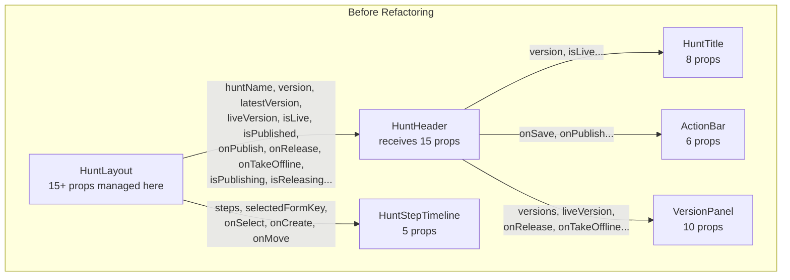
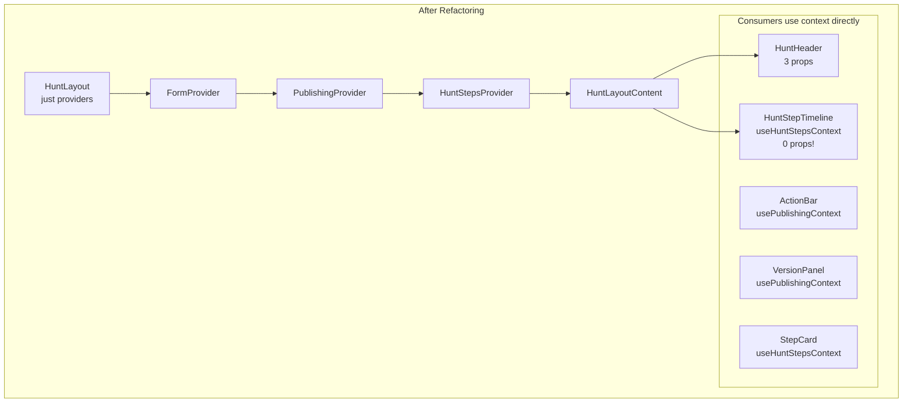
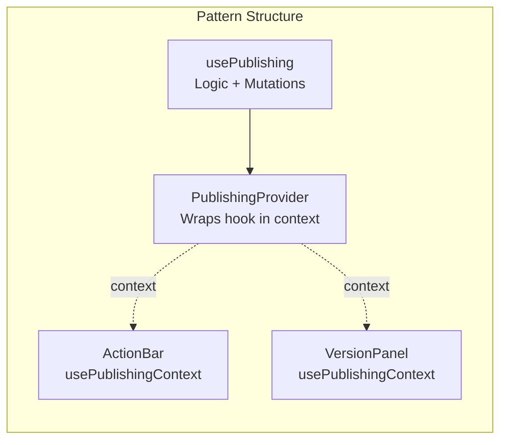
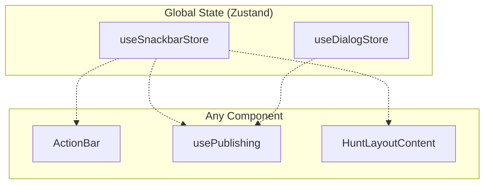
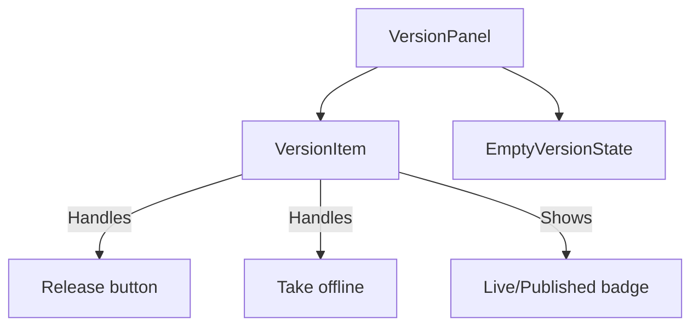
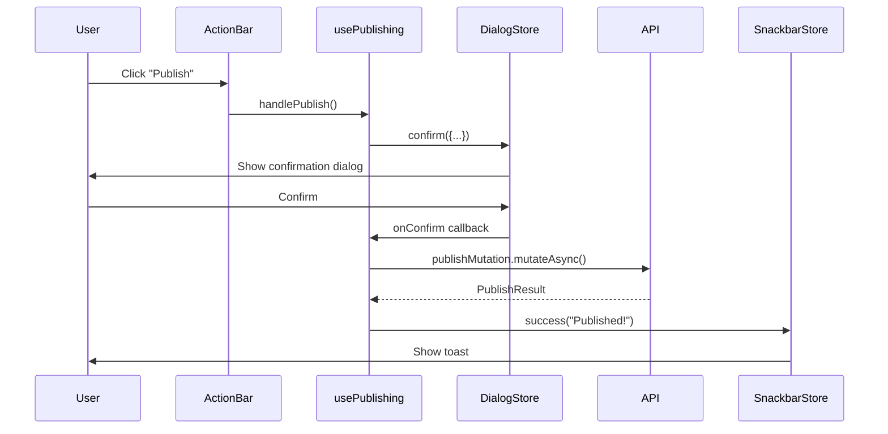
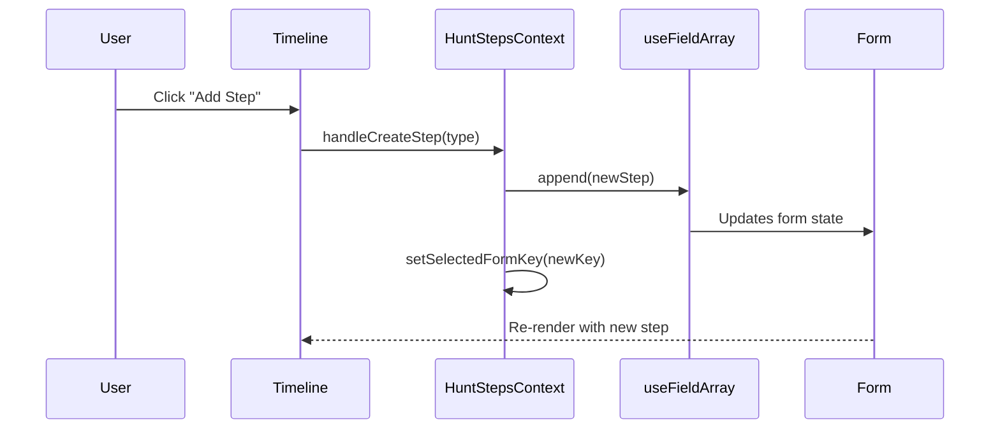

# PR Changes: Publishing Feature Refactoring

**Files changed:** 30 | **+748 / -175 lines**

---

## TL;DR

Refactored the Hunt editor to eliminate prop drilling, extract business logic into hooks, and add a snackbar notification system. The code is now organized by feature with clear separation of concerns.

---

## Architecture Overview

### Before: Prop Drilling Hell



**Problems:**
- HuntLayout was bloated (form + steps + publishing logic)
- Props passed through multiple layers
- Hard to trace where data comes from
- Difficult to add new features

### After: Context + Hooks Pattern



**Benefits:**
- Each provider handles one concern
- Components grab what they need via hooks
- Easy to trace data flow
- Adding features = add to context, consumers opt-in

---

## Patterns Used

### 1. Provider + Hook Pattern (React Context)



**Why:** Separates logic (hook) from distribution (context). Hook can be tested independently. Context eliminates prop drilling.

**Files:**
- `usePublishing.ts` - the logic
- `PublishingContext.tsx` - the provider
- Consumers call `usePublishingContext()`

### 2. Feature-First Folder Structure

```
pages/Hunt/
├── context/           # Hunt-scoped contexts
│   ├── PublishingContext.tsx
│   └── HuntStepsContext.tsx
├── hooks/             # Hunt-scoped hooks
│   └── usePublishing.ts
├── HuntLayout.tsx
├── HuntHeader/
│   └── components/
│       ├── ActionBar/
│       └── VersionPanel/
└── HuntStepTimeline/
```

**Why:**
- Hunt is a feature module, not just a page
- Deleting Hunt deletes everything related
- Global stuff stays in `/src/stores/`, `/src/hooks/`

### 3. Zustand for Global UI State



**Why Zustand vs Context:**
- No provider wrapping needed
- Works outside React (in callbacks)
- Selectors prevent unnecessary re-renders
- Perfect for truly global, UI-only state

### 4. Component Composition (VersionPanel)



**Before:** One 200-line component with complex conditionals
**After:** Small, focused components with single responsibility

---

## Data Flow

### Publishing Flow



### Step Management Flow



---

## File Changes Grouped by Purpose

### New: Publishing API Hooks
| File | Purpose |
|------|---------|
| `api/Hunt/publishHunt.ts` | `usePublishHunt()` - React Query mutation |
| `api/Hunt/releaseHunt.ts` | `useReleaseHunt()` - React Query mutation |
| `api/Hunt/takeOfflineHunt.ts` | `useTakeOfflineHunt()` - React Query mutation |

### New: Contexts
| File | Purpose |
|------|---------|
| `context/PublishingContext.tsx` | Provides publishing state/actions to descendants |
| `context/HuntStepsContext.tsx` | Provides step management state/actions |

### New: Hooks
| File | Purpose |
|------|---------|
| `hooks/usePublishing.ts` | All publishing logic: handlers, mutations, dialogs |

### New: Snackbar System
| File | Purpose |
|------|---------|
| `stores/useSnackbarStore.ts` | Zustand store: `success()`, `error()`, `warning()` |
| `components/Snackbar/Snackbar.tsx` | MUI Snackbar + Alert component |

### New: VersionPanel Components
| File | Purpose |
|------|---------|
| `VersionPanel/VersionPanel.tsx` | Container with menu anchor logic |
| `VersionPanel/VersionItem.tsx` | Single version row (release, take offline actions) |
| `VersionPanel/EmptyVersionState.tsx` | "No versions yet" message |

### Modified: Simplified Components
| File | Before | After |
|------|--------|-------|
| `HuntLayout.tsx` | All logic here | Just providers wrapping |
| `HuntHeader.tsx` | 15+ props | 3 props |
| `HuntStepTimeline.tsx` | 5 props | 0 props (uses context) |
| `ActionBar.tsx` | Props for handlers | Uses `usePublishingContext()` |
| `StepCard.tsx` | Props for delete | Uses `useHuntStepsContext()` |

### Deleted: Old Patterns
| File | Why Removed |
|------|-------------|
| `context/StepFormContext.tsx` | Replaced by HuntStepsContext |
| `hooks/useHuntSteps.ts` | Logic moved into HuntStepsContext |

### Fixed: OpenAPI Schema
| File | Change |
|------|--------|
| `openapi/hunthub_models.yaml` | Added `nullable: true` to server-side fields |

Server fields (`releasedBy`, `releasedAt`, `publishedBy`, `publishedAt`) can be `null`. The fix was at the schema source, not hardcoded in form validation.

---

## Key Decisions

### Why Context instead of Zustand for Publishing?

| Zustand | Context |
|---------|---------|
| Global singleton | Scoped to provider |
| No React integration | Uses React Query mutations |
| Good for UI state | Good for feature state |

Publishing is scoped to a specific hunt instance and uses React Query. Context is the right choice.

### Why Zustand for Snackbar?

| Context | Zustand |
|---------|---------|
| Needs provider at root | No provider needed |
| Access only in components | Access anywhere (callbacks) |
| Re-renders all consumers | Selectors prevent re-renders |

Snackbar is truly global UI state with no server interaction. Zustand is simpler.

### Performance: Is Context OK?

Yes, because:
1. **Same subtree** - consumers would re-render with props anyway
2. **Infrequent changes** - only during user actions, not every keystroke
3. **No expensive computations** - just UI components

---

## Mental Model

```
┌─────────────────────────────────────────────────────────────┐
│ HuntLayout                                                  │
│ ┌─────────────────────────────────────────────────────────┐ │
│ │ FormProvider (React Hook Form)                          │ │
│ │ ┌─────────────────────────────────────────────────────┐ │ │
│ │ │ PublishingProvider                                  │ │ │
│ │ │  - hunt object                                      │ │ │
│ │ │  - publish/release/takeOffline handlers             │ │ │
│ │ │  - loading states                                   │ │ │
│ │ │ ┌─────────────────────────────────────────────────┐ │ │ │
│ │ │ │ HuntStepsProvider                               │ │ │ │
│ │ │ │  - steps array (from useFieldArray)             │ │ │ │
│ │ │ │  - selectedFormKey                              │ │ │ │
│ │ │ │  - create/delete/move handlers                  │ │ │ │
│ │ │ │                                                 │ │ │ │
│ │ │ │   ┌───────────────────────────────────────┐    │ │ │ │
│ │ │ │   │ HuntLayoutContent                     │    │ │ │ │
│ │ │ │   │   - HuntHeader (uses publishing ctx)  │    │ │ │ │
│ │ │ │   │   - HuntStepTimeline (uses steps ctx) │    │ │ │ │
│ │ │ │   │   - HuntForm                          │    │ │ │ │
│ │ │ │   └───────────────────────────────────────┘    │ │ │ │
│ │ │ └─────────────────────────────────────────────────┘ │ │ │
│ │ └─────────────────────────────────────────────────────┘ │ │
│ └─────────────────────────────────────────────────────────┘ │
└─────────────────────────────────────────────────────────────┘

Global (Zustand - no providers):
  - useSnackbarStore → success/error/warning toasts
  - useDialogStore → confirmation dialogs
```

---

## How to Trace Code Now

**"Where does publishing logic live?"**
→ `hooks/usePublishing.ts`

**"How do components get publishing state?"**
→ `usePublishingContext()` from `context/PublishingContext.tsx`

**"Where is step selection managed?"**
→ `context/HuntStepsContext.tsx` (has `selectedFormKey` state)

**"How do toasts work?"**
→ `useSnackbarStore().success("message")` from anywhere

**"Where are providers wired up?"**
→ `HuntLayout.tsx` - the entry point
