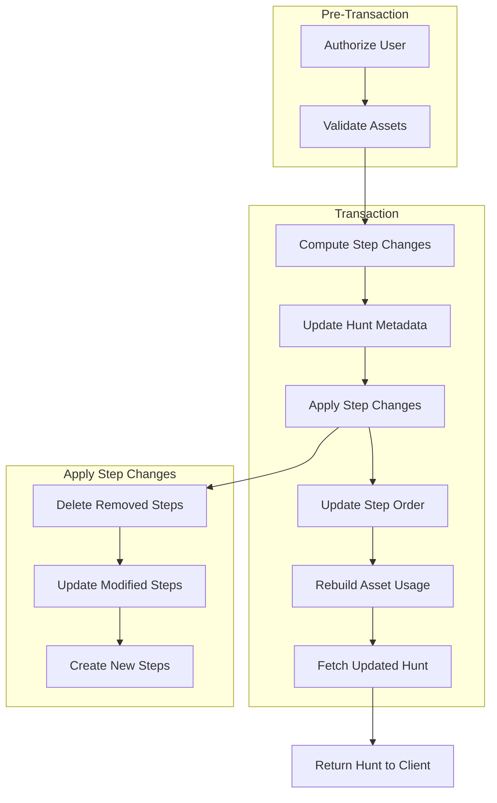

# Hunt Save Service

> **Purpose:** Sync the entire hunt state (metadata + all steps) from the editor to the database in a single atomic operation.

---

## Why This Exists

The editor works with a **local copy** of the hunt. Users can:
- Edit hunt metadata (name, description, cover image)
- Add, edit, reorder, or delete steps
- Work offline or with poor connectivity

When they hit "Save", we need to **sync everything at once** - not individual step updates. This is a **full state replacement** pattern, not a CRUD-per-step pattern.

---

## The Flow



---

## What Each Step Does

### 1. Authorize User
```
authService.requireAccess(huntId, userId, 'admin')
```
- Only **owner** or **admin** collaborators can save
- Returns the hunt document with current `latestVersion`

### 2. Validate Assets
```
validateAllAssets(huntData, userId)
```
- Extracts all asset IDs from cover image and steps
- Validates user owns these assets
- **Fails fast** before starting transaction (no wasted DB writes)

### 3. Compute Step Changes (inside transaction)
```
computeStepChanges(huntId, huntVersion, incomingSteps, session)
```
Compares incoming steps with database to determine:

| Category | How Identified |
|----------|----------------|
| **To Create** | Steps without `stepId` (new) |
| **To Update** | Steps with `stepId` that have changed content |
| **To Delete** | Steps in DB but not in incoming payload |

**Optimization:** Steps with unchanged content are skipped (JSON comparison).

### 4. Update Hunt Metadata
```
updateHuntMetadata(huntId, huntVersion, huntData, session)
```
- Updates name, description, cover image, etc.
- Uses **optimistic locking** via `updatedAt` check
- Prevents overwriting concurrent edits

### 5. Apply Step Changes
```
applyStepChanges(diff, huntId, huntVersion, session)
```

**5a. Delete Removed Steps**
- Bulk delete using `deleteMany`

**5b. Update Modified Steps**
- Sequential updates with optimistic locking
- Throws `ConflictError` if step was modified by another user

**5c. Create New Steps**
- Sequential creates to preserve order
- Triggers pre-save hooks (generates `stepId`)
- Returns array of created IDs in order

### 6. Update Step Order
```
updateStepOrder(huntId, huntVersion, steps, createdStepIds, session)
```
- Maps incoming step order to database IDs
- New steps get their generated IDs inserted at correct positions
- Stores final order in `HuntVersion.stepOrder`

### 7. Rebuild Asset Usage
```
usageTracker.rebuildHuntAssetUsage(huntId, session)
```
- Scans hunt and all steps for asset references
- Updates `AssetUsage` collection
- Enables orphan detection and cleanup

### 8. Fetch & Return
```
fetchHuntWithSteps(huntId, huntVersion, session)
```
- Loads fresh data from DB
- Orders steps by `stepOrder`
- Returns complete hunt DTO to client

---

## Key Design Decisions

### Why Full State Sync?

| Approach | Pros | Cons |
|----------|------|------|
| **CRUD per step** | Simple endpoints | Many requests, complex client logic, race conditions |
| **Full state sync** | Single request, atomic, simple client | Larger payload, need diff logic |

We chose full state sync because:
1. Editor already has full state in memory
2. Single atomic operation = no partial saves
3. Step reordering is natural (just send new order)
4. Simpler client code

### Why Transaction?

All changes happen in one MongoDB transaction:
- Hunt metadata update
- Step deletes/updates/creates
- Step order update
- Asset usage rebuild

If ANY step fails, everything rolls back. No orphaned data.

### Why Optimistic Locking?

```typescript
...(data.updatedAt && { updatedAt: new Date(data.updatedAt) })
```

Client sends `updatedAt` from when they loaded the data. If DB's `updatedAt` doesn't match, someone else edited it. We throw `ConflictError` instead of overwriting.

### Why Skip Unchanged Steps?

```typescript
hasStepChanged(incoming, existing) // JSON comparison
```

If user edits 1 step out of 10, we only write 1 to DB. Saves unnecessary writes and `updatedAt` churn.

---

## Error Handling

| Error | When | HTTP Status |
|-------|------|-------------|
| `NotFoundError` | Hunt doesn't exist | 404 |
| `ForbiddenError` | User lacks permission | 403 |
| `ValidationError` | Invalid assets, published version | 400 |
| `ConflictError` | Optimistic lock failure | 409 |

---

## Architecture Fit

```
┌─────────────────────────────────────────────────────────┐
│                      Editor (FE)                        │
│  - Local hunt state (React Hook Form)                   │
│  - prepareHuntForSave() transformer                     │
└─────────────────────┬───────────────────────────────────┘
                      │ PUT /api/hunts/:id/save
                      ▼
┌─────────────────────────────────────────────────────────┐
│                   HuntSaveService                       │
│  - Orchestrates the save flow                           │
│  - Single public method: saveHunt()                     │
└─────────────────────┬───────────────────────────────────┘
                      │
        ┌─────────────┼─────────────┐
        ▼             ▼             ▼
┌───────────┐  ┌───────────┐  ┌───────────┐
│ StepModel │  │ HuntModel │  │ AssetUsage│
│           │  │ + Version │  │  Tracker  │
└───────────┘  └───────────┘  └───────────┘
```

---

## Related Files

| File | Purpose |
|------|---------|
| `hunt-save.service.ts` | The service (this doc) |
| `hunt.validation.ts` | Zod schema for save payload |
| `step.mapper.ts` | Step DTO ↔ Document transformations |
| `huntOutput.ts` (FE) | Transforms form data → API payload |
| `huntInput.ts` (FE) | Transforms API response → form data |

---

## Quick Reference

```typescript
// The entire save flow in one glance
async saveHunt(huntId, huntData, userId) {
  await authorize(huntId, userId, 'admin');
  await validateAssets(huntData, userId);

  return withTransaction(async (session) => {
    const diff = await computeStepChanges(...);
    await updateHuntMetadata(...);
    const createdIds = await applyStepChanges(diff, ...);
    await updateStepOrder(..., createdIds, ...);
    await rebuildAssetUsage(...);
    return fetchHuntWithSteps(...);
  });
}
```
