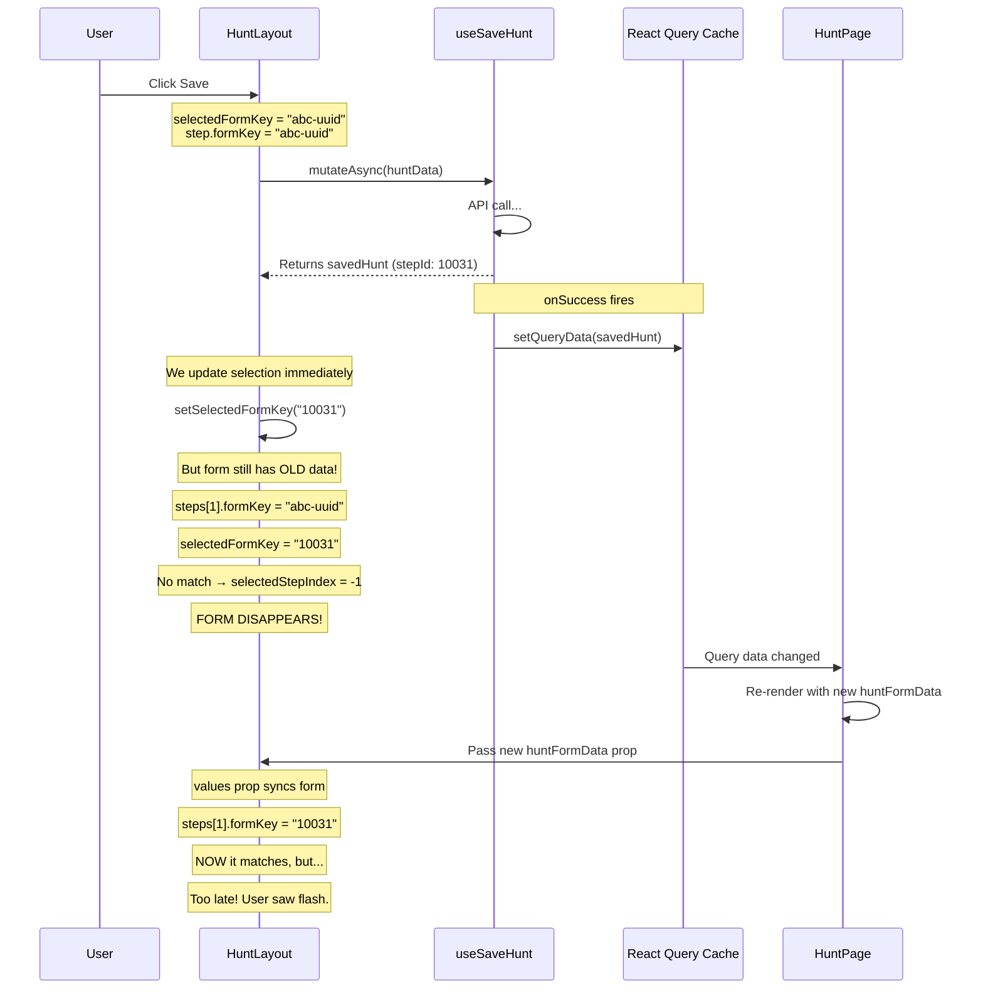
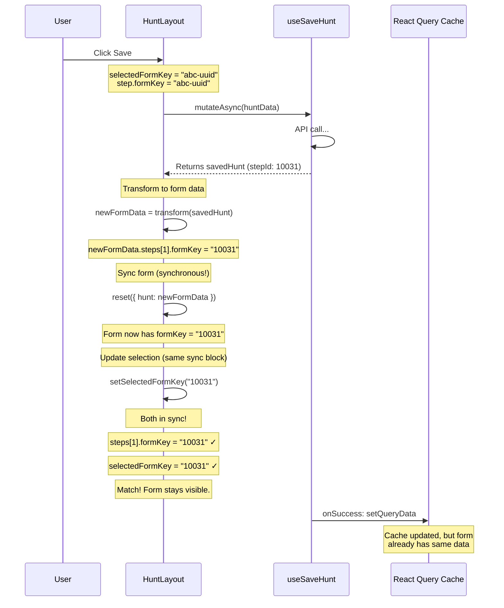

# Form Sync Race Condition Fix

## The Problem

When creating a new step and saving, the step form would disappear.

**Steps to reproduce:**
1. Create a new mission step
2. Add location (click "Match Location" → "Use Current Location")
3. Click Save
4. Step form disappears

---

## What Was Happening

### The Two Sources of Truth

We had two separate pieces of state that needed to stay in sync:

```
┌─────────────────────────────────────────────────────────────┐
│                        HuntPage                             │
│  ┌───────────────────────────────────────────────────────┐  │
│  │  React Query Cache                                    │  │
│  │  hunt.steps[1].stepId = 10031                         │  │
│  └───────────────────────────────────────────────────────┘  │
│                            │                                │
│                            ▼                                │
│                    huntFormData prop                        │
│                            │                                │
│  ┌─────────────────────────▼─────────────────────────────┐  │
│  │                    HuntLayout                         │  │
│  │                                                       │  │
│  │  ┌─────────────────┐    ┌─────────────────────────┐   │  │
│  │  │  Form State     │    │  Selection State        │   │  │
│  │  │  (via values)   │    │  selectedFormKey        │   │  │
│  │  │                 │    │  = "abc-uuid"           │   │  │
│  │  │  formKey =      │    │                         │   │  │
│  │  │  "10031"        │    │  Looking for "abc-uuid" │   │  │
│  │  │                 │    │  but form has "10031"   │   │  │
│  │  └─────────────────┘    └─────────────────────────┘   │  │
│  │          ▲                        ▲                   │  │
│  │          │                        │                   │  │
│  │    Updates async            Updates sync              │  │
│  │    (via React render)       (immediately)             │  │
│  │                                                       │  │
│  │              ═══ MISMATCH ═══                         │  │
│  └───────────────────────────────────────────────────────┘  │
└─────────────────────────────────────────────────────────────┘
```

### The Timeline (Before Fix)



### The Core Issue

The `values` prop in `useForm` auto-syncs with external data, but this sync happens **asynchronously** through React's render cycle:

```typescript
// OLD CODE - values prop auto-syncs
const formMethods = useForm<{ hunt: HuntFormData }>({
  values: { hunt: huntFormData },  // ← Auto-syncs on prop change
  resetOptions: { keepDirtyValues: true },
  mode: 'onBlur',
});
```

**The race condition:**
1. `mutateAsync` returns → we can update selection
2. `onSuccess` fires → `setQueryData` updates cache
3. We call `setSelectedFormKey("10031")` ← **Selection updated**
4. React schedules re-render
5. HuntPage re-renders with new `huntFormData`
6. HuntLayout re-renders, `values` prop syncs form ← **Form updated (too late!)**

Between steps 3 and 6, selection and form are **out of sync**.

---

## The Fix

### Key Insight

We need to control **when** the form syncs, so we can update both form and selection **together**.

### The Solution

Switch from `values` (auto-sync) to `defaultValues` + manual `reset()`:

```typescript
// NEW CODE - manual control
const formMethods = useForm<{ hunt: HuntFormData }>({
  defaultValues: { hunt: huntFormData },  // ← Only for initial render
  mode: 'onBlur',
});

const { reset } = formMethods;

const onSubmit = async (data) => {
  const position = getUnsavedSelectedStepPosition(data.hunt.steps, selectedFormKey);

  const savedHunt = await saveHuntMutation.mutateAsync(prepareHuntForSave(data.hunt));

  // 1. Transform server data to form data (with new formKeys)
  const newFormData = transformHuntToFormData(savedHunt);

  // 2. Sync form IMMEDIATELY (synchronous)
  reset({ hunt: newFormData });

  // 3. Update selection AFTER form is synced (same sync block)
  if (position >= 0) {
    setSelectedFormKey(newFormData.steps[position].formKey);
  }
};
```

### The Timeline (After Fix)



---

## Why This Works

### Before: Two async updates racing

```
Timeline:
─────────────────────────────────────────────────────────►

  mutateAsync      setSelectedFormKey     Form syncs
  returns          ("10031")              (via values prop)
     │                  │                      │
     ▼                  ▼                      ▼
─────●──────────────────●──────────────────────●─────────►
     │                  │                      │
     │                  │                      │
     │              Selection              Form finally
     │              updated                has "10031"
     │                  │                      │
     │                  └──── MISMATCH ────────┘
     │                        Form still has
     │                        "abc-uuid" here!
```

### After: Both updates in same sync block

```
Timeline:
─────────────────────────────────────────────────────────►

  mutateAsync      reset() + setSelectedFormKey
  returns          (both synchronous)
     │                       │
     ▼                       ▼
─────●───────────────────────●───────────────────────────►
     │                       │
     │                       ├── Form has "10031"
     │                       └── Selection is "10031"
     │
     │                       Both updated together!
     │                       No mismatch possible.
```

---

## The `values` vs `defaultValues` Difference

| Prop | Behavior | Control |
|------|----------|---------|
| `values` | Auto-syncs form when prop changes | React controls timing |
| `defaultValues` | Only used on initial render | You control via `reset()` |

### When to use which:

- **`values`**: When you want form to always reflect external data (read-only display, simple forms)
- **`defaultValues` + `reset()`**: When you need to coordinate form sync with other state updates

---

## Key Takeaways

1. **Two sources of truth = potential race condition**
   - Form state (React Hook Form)
   - Selection state (React useState)

2. **`values` prop syncs asynchronously**
   - Through React's render cycle
   - You can't control when it happens

3. **`reset()` syncs synchronously**
   - Happens immediately when called
   - You control the timing

4. **Update related state together**
   - `reset()` then `setSelectedFormKey()` in same handler
   - No render between them = no mismatch

---

## References

- [React Hook Form: values vs defaultValues](https://react-hook-form.com/docs/useform)
- [TkDodo: Mastering Mutations](https://tkdodo.eu/blog/mastering-mutations-in-react-query)
- [GitHub Discussion #11141: useFieldArray ID reassignment](https://github.com/orgs/react-hook-form/discussions/11141)
